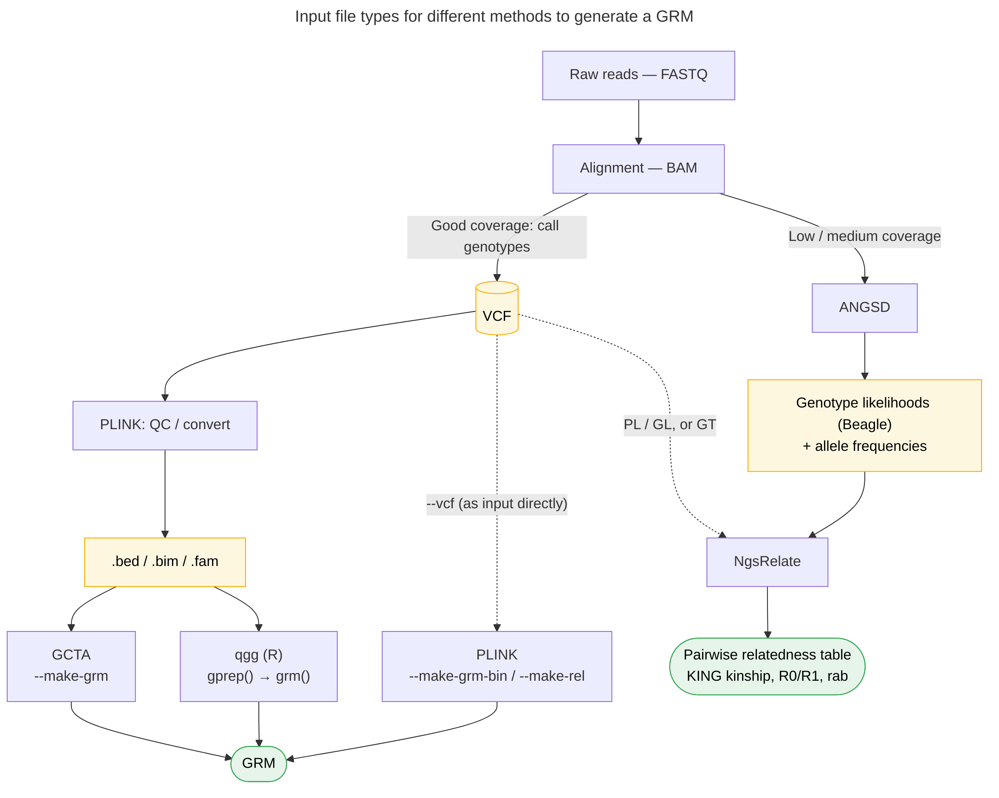

```{r setup_cache, include=FALSE}
knitr::opts_chunk$set(cache = TRUE)
```

> This is a tutorial about how to fit an 'animal model' with GRM (genetic relationship matrix). We provide the sample with the Seychelles warbler data subset including body mass, tarsus length, and also other factors data of 36 individuals and the GRM were calculated from 10k snps genomic data filtered with PLINK -maf0.05 ).

dataset and GRM files can be downloaded from the [Wamwiki github](https://github.com/wamwiki/wamwiki.github.io/tree/master/content/en/docs/Univariate/GRM)

# Why do you want a GRM?

- NGS is (relatively) getting cheaper
- More information to estimate the relatedness, sometimes (like the warblers) the social pedigree can contain errors due to wrong observations or extra-pair paternity...
- No pedigree information in your study
- ...

> Before go to create a GRM, it is better to check the population structure by simply checking with a PCA plot. Or you can check the Fst of your dataset.

# The method to generate GRM

> Preparation - download and setup GCTA

There are many methods and tools (e.g., PLINK, NgsRelate\* or R packages like 'qgg') to estimate the relatedness between individuals and generate a GRM, here is an example by using GCTA -grm flag. Note: NgsRelate accepts genotype likelihood input and vcf input

There is a flowchart to show the input file types for different methods to get a GRM

```{r grm-diagram, echo=FALSE, out.width="100%"}

```

GCTA is a tool developed to study quantitative genetics based on genomic data, there is a function (--make-grm) which could estimate genetic relatedness from SNPs. 

GCTA comes as a pre-compiled executable from the Yang Lab, You need to download the executable files on [GCTA website](https://yanglab.westlake.edu.cn/software/gcta/#Download), with builds for Linux, macOS, and Windows. Unzip it, inside the folder is the executable: gcta64 on Linux/Mac, gcta64.exe on Windows.

Here is the explanation of `--make-grm` function from GCTA website: Estimate the genetic relationship matrix (GRM) between pairs of individuals from a set of SNPs and save the lower triangle elements of the GRM to binary files.

For R (or the terminal) to find it when you just type gcta64, either add the folder containing it to your system 'PATH', or give the full path to the executable in your command (e.g. "/path/to/gcta64 --bfile ..."). If you skip this, you'll get a "command not found" error.

> Laptop, workstation, or HPC?

For a relative small dataset (10k SNPs, ~1000 individuals) a personal laptop is completely fine, and this will finish in minutes. Here, we only have 36 individuals, this will complete in seconds.

But you need a workstation or HPC once you get into the 1,000 to 10,000 of individuals and 100,000 to 1,000,000 of SNPs, where the matrix becomes many gigabytes (that's also when GCTA's --make-grm-part chunking becomes useful). For this step in the tutorial, no special hardware is needed.

If you want to check the details of making a GRM with GCTA, you can check [here](https://yanglab.westlake.edu.cn/software/gcta/#MakingaGRM).

```{r}
# You could run GCTA in R by using system() function or run the command line in terminal

#system("/your/path/to/gcta64 or gcta64.exe --bfile filterd.final.autosome.maf0.05_bodymass_h2_gwas_50ind_10k_WAMBAM  --make-grm --autosome-num 29 --out filterd.final.autosome.maf0.05.36ind.10k.WAMBAM")
```
Notes:

--bfile `your PLINK binary files`, this isn't one file but a trio that share the same prefix: a .bed file (the genotype calls in compact binary form), a .bim file (one row per SNP: chromosome, ID, position, alleles), and a .fam file (one row per individual: IDs, sex, phenotype). You supply only the shared prefix with no extension, and GCTA finds all three

--make-grm, compute the Genetic Relationship Matrix flag

--autosome-num `29`, tells GCTA how many pairs of autosomes the species has. This matters because GCTA defaults to humans (22 autosomes), so for any non-human species you must set it explicitly or the autosome selection will be wrong. 29 indicates the seychelles warbler with 29 autosome pairs

--out `prefix`, the prefix for all output files. Everything GCTA writes here with the prefix you provided

There are 3 output files from GCTA: grm.bin, grm.id, grm.N.bin, you need to put them under the same directory

# Model fitting

Here, we fit the data into animal model in brms

First, you need to install and load all the packages, you can check brms usage tutorial to know how to setup first

```{r}
#install.packages(c("readr","genio","brms","cmdstanr","rstan"))
##setup your work directory
setwd("~/wamwiki.github.io/content/en/docs/Univariate/GRM/")
library(readr)
library(genio)
library(MASS)
library(brms)
library(cmdstanr)
library(tidybayes)
library(rstan)
library(dplyr)
library(ggplot2)
```

load the dataset, GRM

```{r}
dataset <- read.csv("dataset_bodycondition_sw.csv")
grm.data <- genio::read_grm("filterd.final.autosome.maf0.05.36ind.10k.WAMBAM.grm")

#Check the number of SNPs used for GRM
#So there's some missing data (SNPs that didn't match in pairs) in the dataset, but not much to worry about. The counts range from 9,312 to 9,970 SNPs per pair, meaning every relatedness estimate is built on at least ~9,300 markers.

summary(grm.data$M[lower.tri(grm.data$M)])

#Matrix::nearPD() finds the nearest positive-definite matrix to the one you give it. animal models use the GRM as a covariance matrix, which must be positive definite to be both statistically valid and computationally usable, the model equations require inverting and factoring the matrix, which fails if it's singular or has negative eigenvalues
#It is not always necessary to force positive definite your GRM, nearPD() is the safety net that guarantees the matrix satisfies that requirement
GRM_pd <- as.matrix(Matrix::nearPD(grm.data$kinship)$mat)

# You can check your GRM before positive definite step
# Smallest eigenvalue of the raw GRM: > 0 means already positive definite, then you can use your raw GRM
min(eigen(grm.data$kinship, symmetric = TRUE, only.values = TRUE)$values)
```

Check if the dataset and GRM with the same individual

```{r}
dataset_birds <- unique(dataset$BirdID)
cat("Birds in dataset:", length(dataset_birds), "\n")
cat("Birds in GRM:", nrow(GRM_pd), "\n")
cat("Overlap:", sum(dataset_birds %in% rownames(GRM_pd)), "\n")
cat("Missing from GRM:", sum(!dataset_birds %in% rownames(GRM_pd)), "\n")
cat("Missing from model:", sum(!rownames(GRM_pd) %in% dataset_birds), "\n")
```

Keep only birds present in model and GRM

```{r}
birds_in_both <- dataset_birds[dataset_birds %in% rownames(GRM_pd)]
cat("Birds to use in GRM animal model:", length(birds_in_both), "\n")

GRM_sub <- GRM_pd[as.character(birds_in_both), as.character(birds_in_both)]

dim(GRM_sub)

data_final <- dataset[dataset$BirdID %in% birds_in_both, ]
```

Be careful with the prior, but in general the default prior works well. Here we used the default prior get from get_prior() function.

```{r}
# get priors from get_prior() function
my_priors <- c(prior(normal(0, 1),class = b,coef = age_year),
               prior(normal(0, 0.5),class = b,coef = Iage_yearE2), 
               prior(normal(0, 2),class = b,coef = RightTarsus), 
               prior(normal(0, 1),class = b,coef = SexEstimate),  
               prior(normal(0, 1),class = b,coef = summer),
               prior(normal(0, 1),class = b,coef = minutes_s),
               prior(normal(0, 1),class = b,coef = avg_invert),
               prior(normal(0, 1),class = b,coef = group_size),
               # fixed effects priors were provided above
               prior(normal(15.5, 3),class = Intercept), # intercept prior
               prior(student_t(3, 0, 1), class = sd), # random effect sd priors
               prior(student_t(3, 0, 1), class = sigma)) # residual sd prior
```

We set chains = 4 to let the model to run 4 MCMC chains at the same time, and also saved as rda file, brms model structure:

```{r model}
model_grm <- brm(
  BodyMass ~ age_year + I(age_year^2) + RightTarsus + SexEstimate + summer +minutes_s + avg_invert + group_size + (1 | gr(animal, cov = GRM_pd)) + (1 | BirdID) + (1 | BirthYear) + (1 | CatchYear) + (1 | Observer),
  data    = data_final,
  data2   = list(GRM_pd = GRM_pd),
  family  = gaussian(),
  prior   = my_priors,
  warmup  = 1500,
  iter    = 11500,
  chains  = 4,
  cores   = 4,
  seed    = 123,
  file    = "m_brms_GRM",
  backend = "cmdstanr")
```

check the ESS, Rhat and check_hmc_diagnostics() to evaluate the animal model:

```{R}
summary(model_grm)
rstan::check_hmc_diagnostics(model_grm$fit)
```

Also check the mcmc traces if they mixed well:

```{r figure1, fig.width=8, fig.height=6, out.width="80%", fig.path="figures/"}
plot(model_grm)
```

The heritability (h2) can be computed:

```{r}
#Vf (fixed effect variance) calculation
mu_fixed <- posterior_linpred(model_grm, re_formula = NA)
# variance per posterior draw
Vf_GRM <- apply(mu_fixed, 1, var)

h2_draws_Vf_GRM <- model_grm %>%
  spread_draws(sd_animal__Intercept, sd_BirdID__Intercept, sd_BirthYear__Intercept,
               sd_CatchYear__Intercept, sd_Observer__Intercept, sigma) %>%
  mutate(Vf  = Vf_GRM,
         Vg  = sd_animal__Intercept^2,
         Vpe = sd_BirdID__Intercept^2,
         Vby = sd_BirthYear__Intercept^2,
         Vcy = sd_CatchYear__Intercept^2,
         Vobs= sd_Observer__Intercept^2,
         Ve  = sigma^2,
         Vp  = Vg + Vpe + Vby + Vcy + Vobs + Ve + Vf,
         h2  = Vg / Vp,
         repeatability = (Vg + Vpe) / Vp,
         CVa = 100 * (sd_animal__Intercept / mean(data_final$BodyMass, na.rm = TRUE)))
```

We can also get the point estimation:

```{r}
h2_draws_Vf_GRM %>% mean_hdi(h2)
h2_draws_Vf_GRM %>% mean_hdi(repeatability)
h2_draws_Vf_GRM %>% mean_hdi(CVa)
```

Plot the h2

```{r figure2,fig.width=8, fig.height=6, out.width="80%", fig.path="figures/"}
ggplot(h2_draws_Vf_GRM, aes(x = h2)) +
  stat_halfeye(.width = c(0.95), fill = "grey70", color = "black") +
  geom_vline(xintercept = 0, linetype = "dashed", linewidth = 0.4) +
  scale_x_continuous(limits = c(0, NA)) +
  labs(x = expression(h^2), y = NULL) +
  theme_classic(base_size = 16)
```