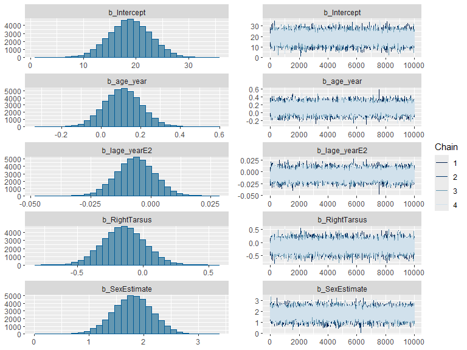
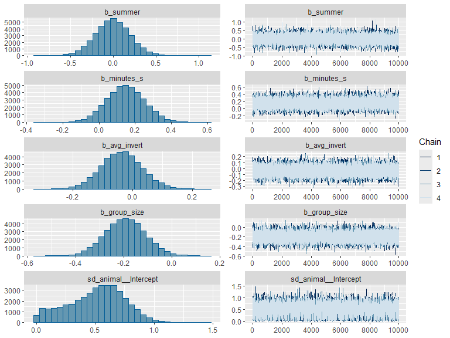
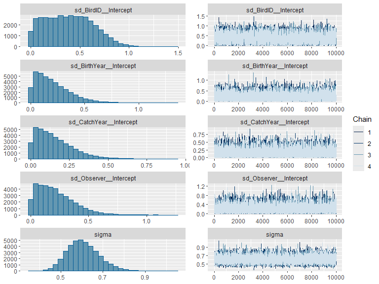
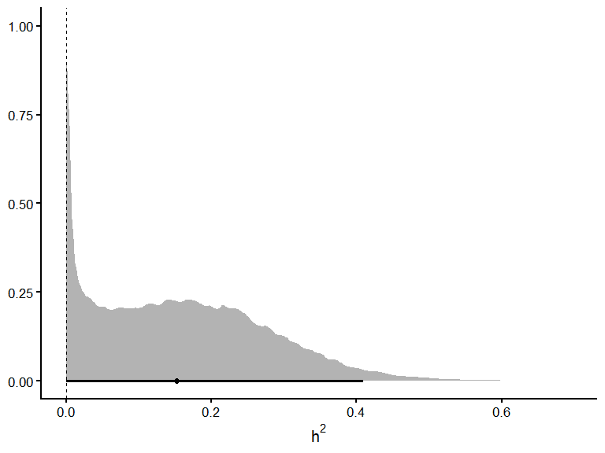

> This is a tutorial about how to fit an 'animal model' with GRM (genetic relationship matrix). We provide the sample with the Seychelles warbler data subset including body mass, tarsus length, and also other factors data of 36 individuals and the GRM were calculated from 10k snps genomic data filtered with PLINK -maf0.05 ).

dataset and GRM files can be downloaded from the [Wamwiki github](https://github.com/wamwiki/wamwiki.github.io/tree/master/content/en/docs/Univariate/GRM)

# Why do you want a GRM?

- NGS is (relatively) getting cheaper
- More information to estimate the relatedness, sometimes (like the warblers) the social pedigree can contain errors due to wrong observations or extra-pair paternity...
- No pedigree information in your study
- ...

> Before go to create a GRM, it is better to check the population structure by simply checking with a PCA plot.

# The method to generate GRM

There are many methods and tools (e.g., PLINK, NgsRelate\* or R packages like 'qgg') to estimate the relatedness between individuals and generate a GRM, here is an example by using GCTA -grm flag. Note: NgsRelate accepts genotype likelihood input and vcf input


``` r
#system("gcta64 or gcta64.exe --bfile filterd.final.autosome.maf0.05_bodymass_h2_gwas_50ind_10k_WAMBAM  --make-grm --autosome-num 29 --out filterd.final.autosome.maf0.05.36ind.10k.WAMBAM")
```

There are 3 output files of GCTA: grm.bin, grm.id, grm.N.bin, you need to put them under the same directory

# Model fitting

Here, we fit the data into animal model in brms

First, you need to install and load all the packages, you can check brms usage tutorial to know how to setup first


``` r
#install.packages(c("readr","genio","brms","cmdstanr","rstan"))
##setup your work directory
setwd("~/wamwiki.github.io/content/en/docs/Univariate/GRM/")
library(readr)
library(genio)
library(MASS)
library(brms)
library(cmdstanr)
library(tidybayes)
library(rstan)
library(dplyr)
library(ggplot2)
```

load the dataset, GRM


``` r
dataset <- read.csv("dataset_bodycondition_sw.csv")
grm.data <- read_grm("filterd.final.autosome.maf0.05.36ind.10k.WAMBAM.grm")
```

```
## Reading: filterd.final.autosome.maf0.05.36ind.10k.WAMBAM.grm.id
```

```
## Reading: filterd.final.autosome.maf0.05.36ind.10k.WAMBAM.grm.bin
```

```
## Reading: filterd.final.autosome.maf0.05.36ind.10k.WAMBAM.grm.N.bin
```

``` r
GRM_pd <- as.matrix(Matrix::nearPD(grm.data$kinship)$mat)
```

Check if the dataset and GRM with the same individual


``` r
dataset_birds <- unique(dataset$BirdID)
cat("Birds in dataset:", length(dataset_birds), "\n")
```

```
## Birds in dataset: 36
```

``` r
cat("Birds in GRM:", nrow(GRM_pd), "\n")
```

```
## Birds in GRM: 36
```

``` r
cat("Overlap:", sum(dataset_birds %in% rownames(GRM_pd)), "\n")
```

```
## Overlap: 36
```

``` r
cat("Missing from GRM:", sum(!dataset_birds %in% rownames(GRM_pd)), "\n")
```

```
## Missing from GRM: 0
```

``` r
cat("Missing from model:", sum(!rownames(GRM_pd) %in% dataset_birds), "\n")
```

```
## Missing from model: 0
```

Keep only birds present in model and GRM


``` r
birds_in_both <- dataset_birds[dataset_birds %in% rownames(GRM_pd)]
cat("Birds to use in GRM animal model:", length(birds_in_both), "\n")
```

```
## Birds to use in GRM animal model: 36
```

``` r
GRM_sub <- GRM_pd[as.character(birds_in_both), as.character(birds_in_both)]

dim(GRM_sub)
```

```
## [1] 36 36
```

``` r
data_final <- dataset[dataset$BirdID %in% birds_in_both, ]
```

Be careful with the prior, but in general the default prior works well. Here we used the default prior get from get_prior() function.


``` r
# get priors from get_prior() function
my_priors <- c(prior(normal(0, 1),class = b,coef = age_year),
               prior(normal(0, 0.5),class = b,coef = Iage_yearE2), 
               prior(normal(0, 2),class = b,coef = RightTarsus), 
               prior(normal(0, 1),class = b,coef = SexEstimate),  
               prior(normal(0, 1),class = b,coef = summer),
               prior(normal(0, 1),class = b,coef = minutes_s),
               prior(normal(0, 1),class = b,coef = avg_invert),
               prior(normal(0, 1),class = b,coef = group_size),
               # fixed effects priors were provided above
               prior(normal(15.5, 3),class = Intercept), # intercept prior
               prior(student_t(3, 0, 1), class = sd), # random effect sd priors
               prior(student_t(3, 0, 1), class = sigma)) # residual sd prior
```

We set chains = 4 to let the model to run 4 MCMC chains at the same time, and also saved as rda file, brms model structure:


``` r
model_grm <- brm(
  BodyMass ~ age_year + I(age_year^2) + RightTarsus + SexEstimate + summer +minutes_s + avg_invert + group_size + (1 | gr(animal, cov = GRM_pd)) + (1 | BirdID) + (1 | BirthYear) + (1 | CatchYear) + (1 | Observer),
  data    = data_final,
  data2   = list(GRM_pd = GRM_pd),
  family  = gaussian(),
  prior   = my_priors,
  warmup  = 1500,
  iter    = 11500,
  chains  = 4,
  cores   = 4,
  seed    = 123,
  file    = "m_brms_GRM",
  backend = "cmdstanr")
```

check the ESS, Rhat and check_hmc_diagnostics() to evaluate the animal model:


``` r
summary(model_grm)
```

```
##  Family: gaussian 
##   Links: mu = identity; sigma = identity 
## Formula: BodyMass ~ age_year + I(age_year^2) + RightTarsus + SexEstimate + summer + minutes_s + avg_invert + group_size + (1 | gr(animal, cov = GRM_pd)) + (1 | BirdID) + (1 | BirthYear) + (1 | CatchYear) + (1 | Observer) 
##    Data: data_final (Number of observations: 87) 
##   Draws: 4 chains, each with iter = 11500; warmup = 1500; thin = 1;
##          total post-warmup draws = 40000
## 
## Multilevel Hyperparameters:
## ~animal (Number of levels: 36) 
##               Estimate Est.Error l-95% CI u-95% CI Rhat Bulk_ESS Tail_ESS
## sd(Intercept)     0.51      0.24     0.04     0.93 1.00     6405    12625
## 
## ~BirdID (Number of levels: 36) 
##               Estimate Est.Error l-95% CI u-95% CI Rhat Bulk_ESS Tail_ESS
## sd(Intercept)     0.39      0.24     0.02     0.85 1.00     5986    15672
## 
## ~BirthYear (Number of levels: 20) 
##               Estimate Est.Error l-95% CI u-95% CI Rhat Bulk_ESS Tail_ESS
## sd(Intercept)     0.20      0.16     0.01     0.58 1.00    17353    21427
## 
## ~CatchYear (Number of levels: 20) 
##               Estimate Est.Error l-95% CI u-95% CI Rhat Bulk_ESS Tail_ESS
## sd(Intercept)     0.15      0.12     0.01     0.44 1.00    18561    24015
## 
## ~Observer (Number of levels: 25) 
##               Estimate Est.Error l-95% CI u-95% CI Rhat Bulk_ESS Tail_ESS
## sd(Intercept)     0.21      0.16     0.01     0.59 1.00    11747    20612
## 
## Regression Coefficients:
##             Estimate Est.Error l-95% CI u-95% CI Rhat Bulk_ESS Tail_ESS
## Intercept      18.86      3.96    11.07    26.60 1.00    46982    30615
## age_year        0.11      0.09    -0.07     0.29 1.00    42264    30117
## Iage_yearE2    -0.01      0.01    -0.02     0.01 1.00    37350    29728
## RightTarsus    -0.15      0.16    -0.46     0.17 1.00    48268    30677
## SexEstimate     1.80      0.36     1.08     2.50 1.00    46365    29003
## summer         -0.01      0.21    -0.41     0.40 1.00    63408    32598
## minutes_s       0.15      0.11    -0.06     0.35 1.00    40911    31233
## avg_invert     -0.04      0.07    -0.17     0.10 1.00    56743    30688
## group_size     -0.19      0.08    -0.36    -0.03 1.00    37239    31108
## 
## Further Distributional Parameters:
##       Estimate Est.Error l-95% CI u-95% CI Rhat Bulk_ESS Tail_ESS
## sigma     0.61      0.08     0.47     0.77 1.00    11485    21178
## 
## Draws were sampled using sample(hmc). For each parameter, Bulk_ESS
## and Tail_ESS are effective sample size measures, and Rhat is the potential
## scale reduction factor on split chains (at convergence, Rhat = 1).
```

``` r
rstan::check_hmc_diagnostics(model_grm$fit)
```

```
## 
## Divergences:
```

```
## 0 of 40000 iterations ended with a divergence.
```

```
## 
## Tree depth:
```

```
## 0 of 40000 iterations saturated the maximum tree depth of 10.
```

```
## 
## Energy:
```

```
## E-BFMI indicated no pathological behavior.
```

Also check the mcmc traces if they mixed well:


``` r
plot(model_grm)
```



The heritability (h2) can be computed:


``` r
#Vf (fixed effect variance) calculation
mu_fixed <- posterior_linpred(model_grm, re_formula = NA)
# variance per posterior draw
Vf_GRM <- apply(mu_fixed, 1, var)

h2_draws_Vf_GRM <- model_grm %>%
  spread_draws(sd_animal__Intercept, sd_BirdID__Intercept, sd_BirthYear__Intercept,
               sd_CatchYear__Intercept, sd_Observer__Intercept, sigma) %>%
  mutate(Vf  = Vf_GRM,
         Vg  = sd_animal__Intercept^2,
         Vpe = sd_BirdID__Intercept^2,
         Vby = sd_BirthYear__Intercept^2,
         Vcy = sd_CatchYear__Intercept^2,
         Vobs= sd_Observer__Intercept^2,
         Ve  = sigma^2,
         Vp  = Vg + Vpe + Vby + Vcy + Vobs + Ve + Vf,
         h2  = Vg / Vp,
         repeatability = (Vg + Vpe) / Vp,
         CVa = 100 * (sd_animal__Intercept / mean(data_final$BodyMass, na.rm = TRUE)))
```

We can also get the point estimation:


``` r
h2_draws_Vf_GRM %>% mean_hdi(h2)
```

```
## # A tibble: 2 × 6
##      h2       .lower .upper .width .point .interval
##   <dbl>        <dbl>  <dbl>  <dbl> <chr>  <chr>    
## 1 0.161 0.0000000211  0.361   0.95 mean   hdi      
## 2 0.161 0.366         0.371   0.95 mean   hdi
```

``` r
h2_draws_Vf_GRM %>% mean_hdi(repeatability)
```

```
## # A tibble: 1 × 6
##   repeatability .lower .upper .width .point .interval
##           <dbl>  <dbl>  <dbl>  <dbl> <chr>  <chr>    
## 1         0.267 0.0822  0.459   0.95 mean   hdi
```

``` r
h2_draws_Vf_GRM %>% mean_hdi(CVa)
```

```
## # A tibble: 1 × 6
##     CVa  .lower .upper .width .point .interval
##   <dbl>   <dbl>  <dbl>  <dbl> <chr>  <chr>    
## 1  3.25 0.00896   5.58   0.95 mean   hdi
```

Plot the h2


``` r
ggplot(h2_draws_Vf_GRM, aes(x = h2)) +
  stat_halfeye(.width = c(0.95), fill = "grey70", color = "black") +
  geom_vline(xintercept = 0, linetype = "dashed", linewidth = 0.4) +
  scale_x_continuous(limits = c(0, NA)) +
  labs(x = expression(h^2), y = NULL) +
  theme_classic(base_size = 16)
```


