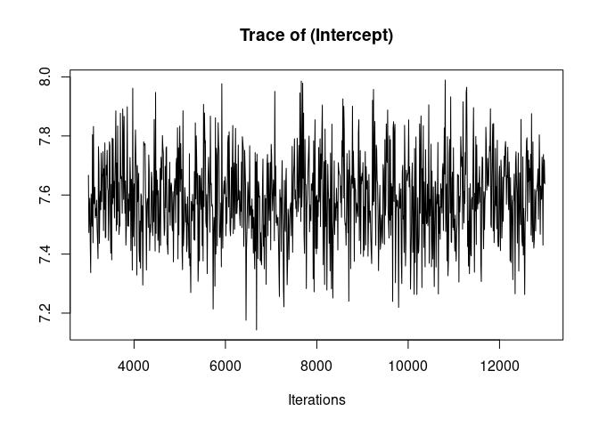
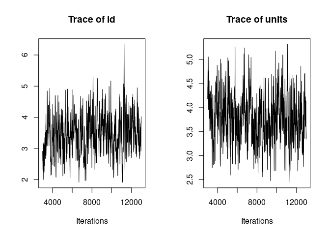
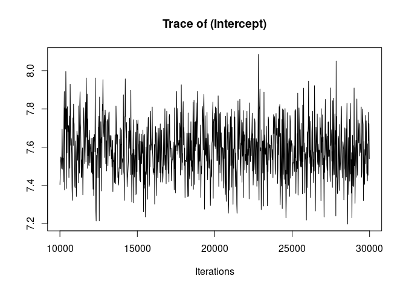

```{r setup_fig, include=FALSE}
knitr::opts_chunk$set(fig.path = "plots/")
```

# Example data

We will use the simulated gryphon dataset ([download zip file](/docs/data/gryphons.zip) ).

We need to load both the phenotypic data `gryphon.csv` and the pedigree `gryphonped.csv`.

```{r}
phenotypicdata <- read.csv("data/gryphon.csv")
pedigreedata <- read.csv("data/gryphonped.csv")
```

The phenotypic data look like this:

```{r}
head(phenotypicdata)
```

We will use `birth_weight` as a response variable.

And the pedigree looks like this:

```{r}
head(pedigreedata)
tail(pedigreedata)
```


# Simplest animal model

Here is the simplest implementation of an animal model in MCMCglmm. 

First, we load the package:

```{r, message=FALSE, results='hide'}
library(MCMCglmm)
```

Second, while not strictly necessary we think it is a good practice to convert the pedigree to an inverse-relatedness matrix. If the pedigree is properly formatted this is easily done with `MCMCglmm::inverseA`. The other option is to pass the pedigree directly in the `pedigree` argument of the function `MCMCglmm`, but that solution is less flexible.

```{r, cache=TRUE}
inverseAmatrix <- inverseA(pedigree = pedigreedata)$Ainv
```

Now we can fit the model of `birth_weight` to estimate three parameters:

* an additive genetic variance (corresponding to the `id` column) 
* a residual variance
* an intercept

```{r, echo=FALSE}
set.seed(12345)
```


```{r, cache=TRUE, message=FALSE, results='hide'}
model1.1 <- MCMCglmm(birth_weight ~ 1, #Response and Fixed effect formula
                   random = ~id, # Random effect formula
          ginverse = list(id = inverseAmatrix), # correlations among random effect levels (here breeding values)
          data = phenotypicdata)# data set
```

Note the use of the argument `ginverse` to link the elements of the relatedness matrix to the individual identity in the phenotypic data.

Let's look at the results.

It is always a good idea to look at the trace of the MCMC sampling. Ideally we want to see "hairy caterpillars" for each parameter, that is, a stationary distribution without long-term or short-term trends across iterations. This lack of trend would indicate that the model may have converged and may have explored properly the multivariate parameter space, thus giving us reliable parameter estimates.

```{r model1.1-plot}
plot(model1.1, density=FALSE)
```

<!-- --><!-- -->


Here the traces of the random effect variance `id` and of the residual variance are not bad but show an initial trend as well as some fluctuations. We are going to re-run the model for longer to avoid those problems before we look at the results.

We do that by increasing the `burnin` value from 3000 to 10000 (this is the number of samples we discard at the beginning of the chain to remove the influence of random starting parameter values), the `nitt` value from 13000 to 30000 (this is the total number of samples), and the `thin` value from 10 to 20 (this is the interval between samples that are saved in the model output; thinning is used to reduce the memory used by the model, much of which would be made of redundant if all samples were saved because of auto-correlation in MCMC.)

```{r, cache=TRUE, message=FALSE, results='hide'}
model1.2 <- MCMCglmm(birth_weight ~ 1, #Response and Fixed effect formula
                   random = ~id, # Random effect formula
          ginverse = list(id = inverseAmatrix), # correlations among random effect levels (here breeding values)
          data = phenotypicdata, # data set
          burnin = 10000, nitt = 30000, thin = 20) # run the model for longer compare to the default
```

```{r model1.2-plot}
plot(model1.2, density=FALSE)
```

<!-- --><!-- -->

Much better. Now we can look at the model summary.

```{r}
summary(model1.2)
```

Among other things, the summary gives the posterior mean and 95% credible intervals for the intercept, the residual variance and the additive genetic variance. 

The posterior mean is often not a great point estimate for variance parameters, because of the skew in their posterior distribution. We can  obtain the posterior mode or posterior median of the additive genetic variance as

```{r}
posterior.mode(model1.2$VCV[, "id"])

median(model1.2$VCV[, "id"])
```

We can get the 95% credible interval of the additive genetic variance as

```{r}
HPDinterval(model1.2$VCV[, "id"])
```


```{r, echo=FALSE, message=FALSE, }
list.of.files <- list.files(path = "_index_files/figure-html/", pattern = "*.png", full.names = TRUE)
file.copy(from = list.of.files, to = ".", overwrite = TRUE, )
```
