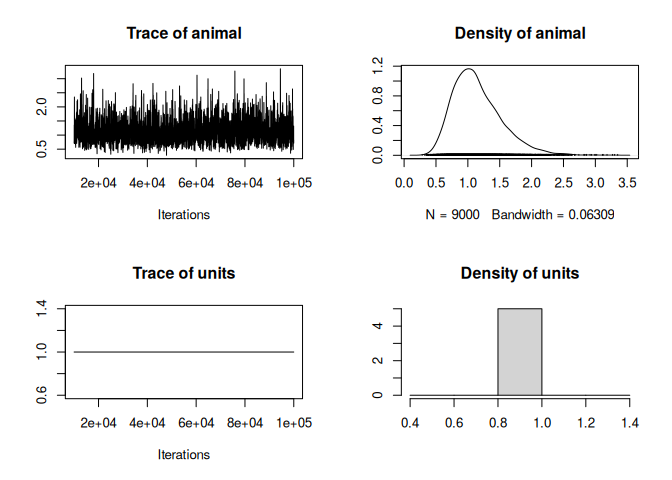
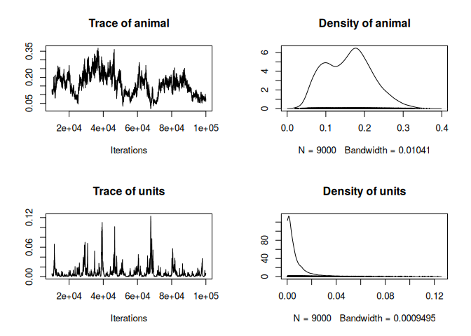

{}
When traits are non-Gaussain (i.e. we cannot assume the residual of a linear model will follow a normal distribution), like survival or (often) fecundity, we need to use models that extend the principals of the animal models beyond the normal distribution.
Such models are called generalised linear mixed models (GLMMs), or generalised animal models in our case, and can be implemented in MCMCglmm relatively easily, by specifying another "family" of distribution.
{}

{}
To have access to non-Gaussian traits, we will use the phoenix dataset from de Villemereuil (2018, Annals of the New York Academy of Sciences), which contains traits such as a golden/white plumage polymorphism (a binary trait) or the number of revivals (following a Poisson distribution) . We will also use a new package named "QGglmm" to analyse the quantitative genetics of those traits after running the model.
{}


``` r
library(MCMCglmm)
library(QGglmm)
```


``` r
tbl_phoenix <- read.csv("data/phoenix_data.csv")
ped_phoenix <- read.csv("data/phoenix_pedigree.csv")
```


## A bit of theory

A GLMM can be written as:
$$
\mathbf{l} = \mu + \mathbf{X}\mathbf{\beta} + \mathbf{a} + \mathbf{e}\\
\mathbf{\eta} = g^{-1}(\mathbf{l})\\
\mathbf{y} \sim \mathcal{D}(\mathbf{\eta})
$$
In words, a hypothetical latent trait $\mathbf{l}$ behaves like a classical Gaussian trait in a classical animal model. Then such trait is transformed, using a link function ((or rather, the inverse of a link function, for historical reasons), into expectations of average phenotype $\mathbf{\eta}$.
Then, the actual phenotype $\mathbf{y}$ is modeled as being sampled around such expectations, following a distribution $\mathcal{D}$ of choice (e.g. a Poisson or a binomial distribution).
Following de Villemereuil et al. (2016, Genetics), we will refer to $l$ as the latent scale, $\eta$ as the expected data scale and $y$ as the observed data scale.

## A binary trait

Let's start with a binary trait. We will use a special prior for binary trait (de Villemereuil, 2013, Methods in Ecology & Evolution), that looks like a chi-squared distribution. We also require to fix the residual variance to 1 (using the `fix` argument), because this component is not identifiable for a binary trait:

``` r
prior_bin <- list(R = list(V = 1, fix = 1),
              G = list(G1 = list(V = 1, nu = 1000, alpha.mu = 0, alpha.V = 1)))
```

Then we run the model the same as we would do for a Gaussian trait, only this time, we change the family for something relevant for the trait's distribution (here the "threshold" family for a binary trait):

``` r
model_bin <- MCMCglmm(White ~ 1,
                      random   = ~ animal,
                      family   = "threshold",
                      prior    = prior_bin,
                      pedigree = ped_phoenix,
                      data     = tbl_phoenix,
                      nitt     = 100000,
                      burnin   = 10000,
                      thin     = 10)
```


Let's look at the trace of the model:

``` r
plot(model_bin$VCV)
```

<!-- -->

We could compute the heritability as:

``` r
herit_bin_lat <- model_bin$VCV[,"animal"] / rowSums(model_bin$VCV)

median(herit_bin_lat); HPDinterval(herit_bin_lat)
```

```
## [1] 0.5219637
```

```
##          lower     upper
## var1 0.3649965 0.6742187
## attr(,"Probability")
## [1] 0.95
```
This estimate has some meaning, but maybe not the one you think. It is the heritability on the latent scale, i.e. the heritability of $l$, not $y$. Because we used the "threshold" family in MCMCglmm, this estimate also happen to the one corresponding to the historical threshold model, called the "liability scale".

If we want to get to the heritability of $y$, we need to account for the influence of the link function $g$ and assumed distribution function $\mathcal{D}$. Fortunately, there is a tool to help us do that, which is the QGglmm package :

``` r
QGparams(mu    = mean(model_bin$Sol[ , "(Intercept)"]),
         var.a = mean(model_bin$VCV[ , "animal"]),
         var.p = mean(rowSums(model_bin[["VCV"]]) - 1), # Note the -1 here
         model = "binom1.probit")
```

```
## [1] "Using the closed forms for a Binomial1 - probit model."
```

```
##    mean.obs   var.obs  var.a.obs    h2.obs
## 1 0.3010079 0.2104021 0.06487425 0.3083345
```
This yields the quantitative genetics parameters values on the observed data scale, including heritability. The `-1` for the `var.p` argument is needed because the `"threshold"` family in MCMCglmm treats the residual variance a bit differently from a classicial binomial model with a probit link.

The problem with this approach is that we provided QGglmm with mean estimates of the parameters, but the proper way to do it would rather to use the full posterior distribution:

``` r
obs_qg_bin <-
  do.call("rbind",
          mapply(QGparams,
                 mu       = model_bin$Sol[ , "(Intercept)"],
                 var.a    = model_bin$VCV[ , "animal"],
                 var.p    = rowSums(model_bin[["VCV"]]) - 1,
                 model    = "binom1.probit",
                 verbose  = FALSE,
                 SIMPLIFY = FALSE))

head(obs_qg_bin)
```

```
##    mean.obs   var.obs  var.a.obs    h2.obs
## 1 0.2116982 0.1668821 0.03622726 0.2170830
## 2 0.3356647 0.2229939 0.05562425 0.2494429
## 3 0.2621380 0.1934216 0.04611895 0.2384374
## 4 0.2555097 0.1902245 0.04727477 0.2485210
## 5 0.3158890 0.2161031 0.07280270 0.3368887
## 6 0.3797171 0.2355320 0.07699120 0.3268821
```
Now, we have the full posterior distribution of the estimates, including the heritability on the observed data scale :

``` r
median(obs_qg_bin$h2.obs); HPDinterval(as.mcmc(obs_qg_bin$h2.obs))
```

```
## [1] 0.2987926
```

```
##          lower     upper
## var1 0.2085816 0.3903584
## attr(,"Probability")
## [1] 0.95
```


## A Poisson trait

The Poisson trait would very similar, except we will use a different prior, because we do not require to fix the residual variance to 1 any more:

``` r
prior_pois <- list(R = list(V = 1, nu = 0.02),
                   G = list(G1 = list(V = 1, nu = 0.02)))
```
And we will select the "Poisson" family instead in the model call:

``` r
model_pois <- MCMCglmm(White ~ 1,
                       random   = ~ animal,
                       family   = "poisson",
                       prior    = prior_pois,
                       pedigree = ped_phoenix,
                       data     = tbl_phoenix,
                       nitt     = 100000,
                       burnin   = 10000,
                       thin     = 10)
```

Let's look at the trace of the model:

``` r
plot(model_pois$VCV)
```

<!-- -->

It's not the best looking trace ever, technically, the model should probably be run for longer and/or a better prior should be used.

Assuming the model is satisfying, we again could compute the heritability as:

``` r
herit_pois_lat <- model_pois$VCV[,"animal"] / rowSums(model_pois$VCV)

median(herit_pois_lat); HPDinterval(herit_pois_lat)
```

```
## [1] 0.9732022
```

```
##          lower     upper
## var1 0.8108756 0.9985784
## attr(,"Probability")
## [1] 0.95
```
But again, that would be the heritability of the latent trait $l$, not of the actual trait $y$.

We can again compute the heritiability on the observed data scale using the QGglmm package, this time specifying that we are using a Poisson distribution:

``` r
obs_qg_pois <-
  do.call("rbind",
          mapply(QGparams,
                 mu       = model_bin$Sol[ , "(Intercept)"],
                 var.a    = model_bin$VCV[ , "animal"],
                 var.p    = rowSums(model_bin[["VCV"]]),
                 model    = "Poisson.log",
                 verbose  = FALSE,
                 SIMPLIFY = FALSE))

head(obs_qg_pois)
```

```
##    mean.obs   var.obs var.a.obs    h2.obs
## 1 0.8336904  4.181518 0.5287448 0.1264481
## 2 1.3543819  9.759201 1.3198703 0.1352437
## 3 1.0382519  6.281669 0.8288072 0.1319406
## 4 1.0297736  6.669180 0.8943758 0.1341058
## 5 1.5564035 24.683635 3.2844415 0.1330615
## 6 1.8580019 27.560042 3.9133675 0.1419942
```
Now, we have the full posterior distribution of the estimates, including the heritability on the observed data scale :

``` r
median(obs_qg_pois$h2.obs); HPDinterval(as.mcmc(obs_qg_pois$h2.obs))
```

```
## [1] 0.1353779
```

```
##          lower     upper
## var1 0.1071855 0.1436642
## attr(,"Probability")
## [1] 0.95
```


## Reading to go further

- Kruuk & Hadfield, 2007. How to separate genetic and environmental causes of similarity between relatives. Journal of Evolutionary Biology https://doi.org/10.1111/j.1420-9101.2007.01377.x
- Ponzi & al, 2018. Heritability, selection, and the response to selection in the presence of phenotypic measurement error: Effects, cures, and the role of repeated measurements. Evolution https://doi.org/10.1111/evo.13573

