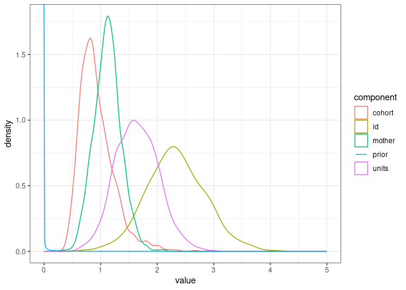

We still use the gryphon dataset with `birth_weight` as the response, and MCMCglmm.


``` r
phenotypicdata <- read.csv("data/gryphon.csv")
pedigreedata <- read.csv("data/gryphonped.csv")
```


``` r
library(MCMCglmm)
library(tidyverse)
```


``` r
phenotypicdata$sexMF <- ifelse(phenotypicdata$sex==1, "M", "F")

inverseAmatrix <- inverseA(pedigree = pedigreedata)$Ainv
```


# Visualising prior

Here is a function to compute the density of a variance prior as defined in MCMCglmm:


``` r
dprior <- function(v, V=1, nu=0.002, alpha.V=1, alpha.mu=0){
  if(alpha.V==1){
    d <- df(v/alpha.V, df1 = 1, df2 = nu, ncp = (alpha.mu^2)/alpha.V)
  }else{
    d <- dinvgamma(v, shape = nu/2, scale = nu * V / 2)
  }
  return(d)
}
```

Let's visualise the distribution from the minimum (0, as a variance is positive) to an arbitrary value (here, 5):


``` r
v <- seq(0, 5, by=0.01)
plot(dprior(v))
```

<!-- -->

``` r
curve(dprior(x), from=0, to = 5)
```

<!-- -->

The density is infinite for `v=0` so the graph will look a bit different depending on how close to `0` the second value is (here `0.01`).

How does this compare to the posterior distribution of the various variance components from one of our previous models?


``` r
prior1.6 <- list(
  G = list(G1 = list(V = 1, nu = 0.002),
           G2 = list(V = 1, nu = 0.002),
           G3 = list(V = 1, nu = 0.002)),
  R = list(V = 1, nu = 0.002)
)

model1.6 <- MCMCglmm(birth_weight ~ 1 + sexMF + scale(cohort), 
                   random = ~id + mother + cohort, # Random effect formula
          ginverse = list(id = inverseAmatrix),
          data = phenotypicdata, 
          prior = prior1.6,
          burnin = 10000, nitt = 30000, thin = 20) 
```


``` r
posterior <- model1.6$VCV %>% 
  as_tibble() %>%
  pivot_longer(cols = 1:ncol(model1.6$VCV), names_to = "component")

prior <- tibble(value=seq(0, 5, by=0.01), density=dprior(value), component="prior")

ggplot(posterior, mapping = aes(x=value, color=component)) + 
  geom_density() + 
  geom_line(data=prior,aes(x=value, y=density)) +
  theme_bw()
```

<!-- -->


# Different random effect priors


# Fixed effect prior


``` r
prior1.7 <- list(
  G = list(G1 = list(V = 1, nu = 1, alpha.V=1000),
           G2 = list(V = 1, nu = 1, alpha.V=1000),
           G3 = list(V = 1, nu = 1, alpha.V=1000)),
  R = list(V = 1, nu = 0.002)
)

model1.7 <- MCMCglmm(birth_weight ~ 1 + sexMF + scale(cohort), 
                   random = ~id + mother + cohort, # Random effect formula
          ginverse = list(id = inverseAmatrix),
          data = phenotypicdata, 
          prior = prior1.7,
          burnin = 10000, nitt = 30000, thin = 20) 
```


``` r
summary(model1.6)
```

```
## 
##  Iterations = 10001:29981
##  Thinning interval  = 20
##  Sample size  = 1000 
## 
##  DIC: 3324.586 
## 
##  G-structure:  ~id
## 
##    post.mean l-95% CI u-95% CI eff.samp
## id     2.331    1.361      3.4    167.2
## 
##                ~mother
## 
##        post.mean l-95% CI u-95% CI eff.samp
## mother     1.122   0.6456    1.574    707.7
## 
##                ~cohort
## 
##        post.mean l-95% CI u-95% CI eff.samp
## cohort    0.9345   0.4707    1.571     1000
## 
##  R-structure:  ~units
## 
##       post.mean l-95% CI u-95% CI eff.samp
## units     1.643   0.9313    2.399    182.3
## 
##  Location effects: birth_weight ~ 1 + sexMF + scale(cohort) 
## 
##               post.mean l-95% CI u-95% CI eff.samp  pMCMC    
## (Intercept)      8.3233   7.9317   8.7941   1000.0 <0.001 ***
## sexMFM          -1.9837  -2.2666  -1.6763    752.3 <0.001 ***
## scale(cohort)   -0.1382  -0.4758   0.2102   1000.0  0.428    
## ---
## Signif. codes:  0 '***' 0.001 '**' 0.01 '*' 0.05 '.' 0.1 ' ' 1
```

``` r
summary(model1.7)
```

```
## 
##  Iterations = 10001:29981
##  Thinning interval  = 20
##  Sample size  = 1000 
## 
##  DIC: 3319.025 
## 
##  G-structure:  ~id
## 
##    post.mean l-95% CI u-95% CI eff.samp
## id     2.343    1.366    3.387    247.3
## 
##                ~mother
## 
##        post.mean l-95% CI u-95% CI eff.samp
## mother     1.128   0.6902    1.556    602.6
## 
##                ~cohort
## 
##        post.mean l-95% CI u-95% CI eff.samp
## cohort    0.9905   0.4489    1.567    634.2
## 
##  R-structure:  ~units
## 
##       post.mean l-95% CI u-95% CI eff.samp
## units     1.645   0.8858    2.373    222.7
## 
##  Location effects: birth_weight ~ 1 + sexMF + scale(cohort) 
## 
##               post.mean l-95% CI u-95% CI eff.samp  pMCMC    
## (Intercept)      8.3162   7.8717   8.7140    981.6 <0.001 ***
## sexMFM          -1.9723  -2.2532  -1.6619   1000.0 <0.001 ***
## scale(cohort)   -0.1533  -0.5037   0.2027   1000.0  0.426    
## ---
## Signif. codes:  0 '***' 0.001 '**' 0.01 '*' 0.05 '.' 0.1 ' ' 1
```


# Multivariate variance-covariance prior


``` r
mv_iw_prior <- function(v,V,nu,variable=1){
  if(!is.matrix(V)){V <- as.matrix(V)}
  nu.ast <- nu - dim(V)[1] + 1
  V.ast <- V[variable,variable] * (nu/nu.ast) 
  return(MCMCpack::dinvgamma(v, shape = nu.ast/2, scale = (nu.ast * V.ast)/2))
}
```
