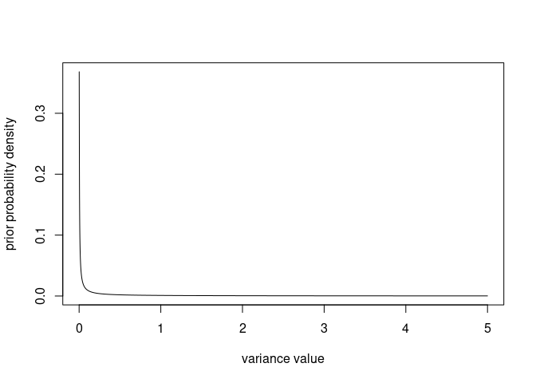
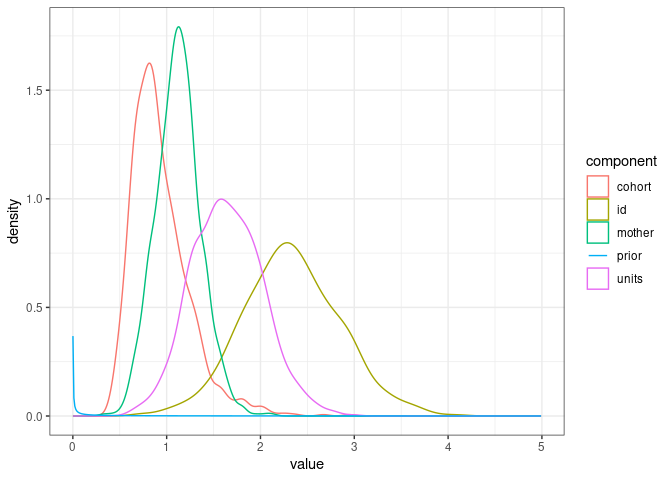
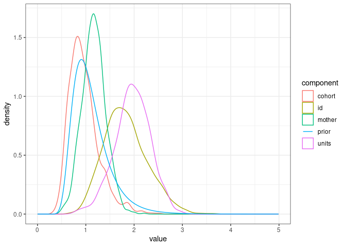
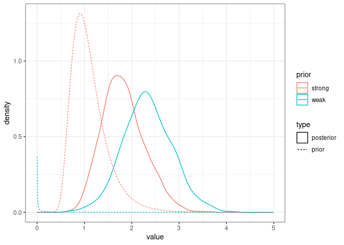
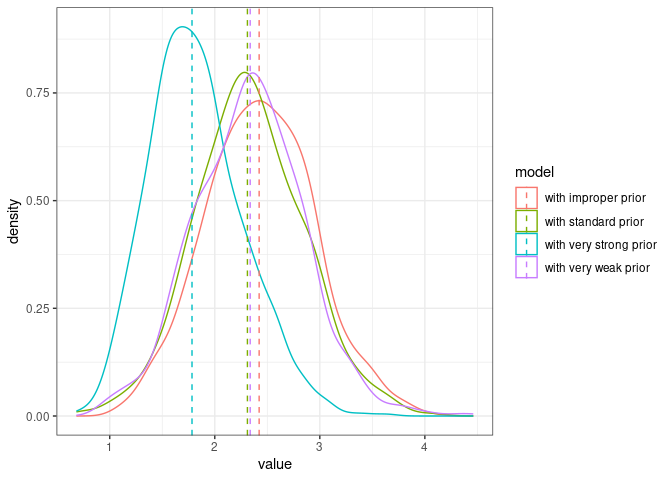
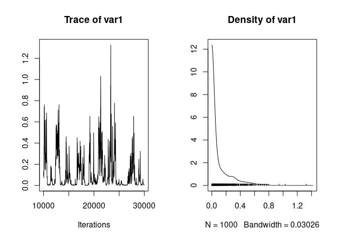
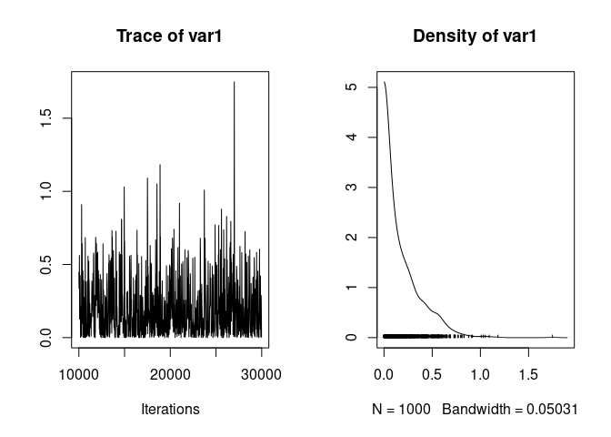
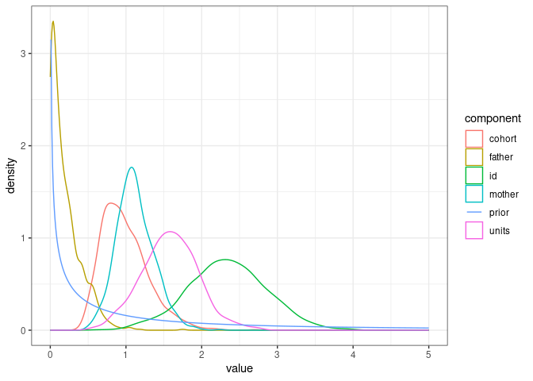
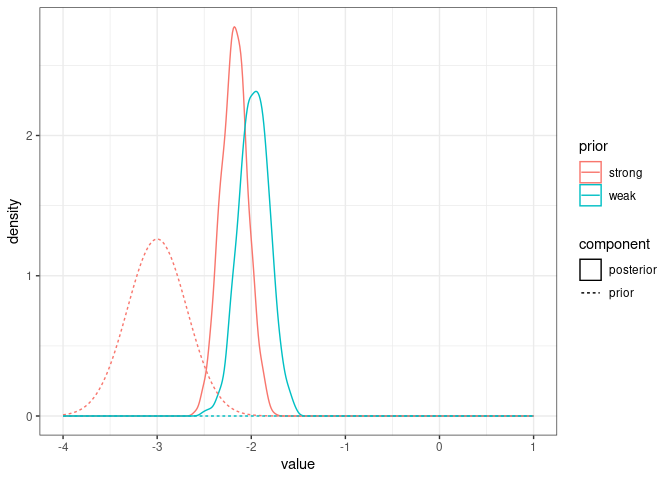

We still use the gryphon dataset with `birth_weight` as the response, and MCMCglmm.


``` r
phenotypicdata <- read.csv("data/gryphon.csv")
pedigreedata <- read.csv("data/gryphonped.csv")
```


``` r
phenotypicdata$sexMF <- ifelse(phenotypicdata$sex==1, "M", "F")
inverseAmatrix <- inverseA(pedigree = pedigreedata)$Ainv
```

This time we load the tidyverse for data wrangling and plotting, and MCMCpack for prior visualisation


``` r
library(MCMCglmm)
library(tidyverse)
library(MCMCpack)
```


# Visualising a variance prior

Here is a function to compute the density of a variance prior as defined in MCMCglmm:


``` r
dprior <- function(v, V=1, nu=0.002, alpha.V=1, alpha.mu=0){
  require(MCMCpack)
  if(alpha.V!=1 | alpha.mu!=0){
    d <- df(v, df1 = 1, df2 = nu, ncp = (alpha.mu^2)/alpha.V) # TO BE CONFIRMED, IS IT THE CORRECT CODE FOR PARAMETER EXPANDED PRIOR ?
  }else{
    d <- dinvgamma(v, shape = nu/2, scale = nu * V / 2)
  }
  return(d)
}
```

Let's visualise the distribution from the minimum (0, as a variance is positive) to an arbitrary value (here, 5):


``` r
v <- seq(0, 5, by=0.001)
plot(x = v, y = dprior(v), xlab = "variance value", ylab = "prior probability density", type = "l")
```

<!-- -->

The density tends to infinity for `v` approaching $0$ so the graph will look a bit different depending on how close to `0` the second `v` value is (here `0.001`), but that will not matter when we compare the prior to other distributions.

Let's look at the prior vs. the posterior distributions of the various variance components from one of our previous models


``` r
prior1.6 <- list(
  G = list(G1 = list(V = 1, nu = 0.002),
           G2 = list(V = 1, nu = 0.002),
           G3 = list(V = 1, nu = 0.002)),
  R = list(V = 1, nu = 0.002)
)

model1.6 <- MCMCglmm(birth_weight ~ 1 + sexMF + scale(cohort), 
                   random = ~id + mother + cohort, # Random effect formula
          ginverse = list(id = inverseAmatrix),
          data = phenotypicdata, 
          prior = prior1.6,
          burnin = 10000, nitt = 30000, thin = 20) 
```

The variance components are stored in `model1.6$VCV`, we just need to reformat them a little


``` r
posterior_model1.6 <- model1.6$VCV %>% 
  as_tibble() %>%
  pivot_longer(cols = 1:ncol(model1.6$VCV), names_to = "component")

prior_model1.6 <- tibble(value=seq(0.001, 5, by=0.01), 
                         density=dprior(value, V = 1, nu = 0.002), component="prior")

ggplot(posterior_model1.6, mapping = aes(x=value, color=component)) + 
  geom_density() + 
  geom_line(data=prior_model1.6, aes(x=value, y=density)) +
  theme_bw()
```

<!-- -->

So the prior is very dense close to `0` and then very flat and not dense for the range of estimated parameter values. That means the data brought lots of information and weigh heavily on the posterior distribution.


# Different random effect priors

We can always specify a prior so strong that it will override the signal in the data and influence the posterior distribution, but we almost never want to do that.

Therefore it is a good idea to check that the posterior distribution is not too influenced by the choice of a prior. 

For instance, if we had set one of the `nu` parameters to 20, corresponding to a "high degree of belief", the estimation of the additive genetic variance ($V_A$, correspondong to the `id` random effect in our model) would have been subtly but significantly influenced by the prior:


``` r
prior1.7 <- list(
  G = list(G1 = list(V = 1, nu = 20),
           G2 = list(V = 1, nu = 0.002),
           G3 = list(V = 1, nu = 0.002)),
  R = list(V = 1, nu = 0.002)
)

model1.7 <- MCMCglmm(birth_weight ~ 1 + sexMF + scale(cohort), 
                   random = ~id + mother + cohort, # Random effect formula
          ginverse = list(id = inverseAmatrix),
          data = phenotypicdata, 
          prior = prior1.7,
          burnin = 10000, nitt = 30000, thin = 20) 
```

We can see the prior has areas of relatively high density overlapping with the posterior distribution of $V_A$.


``` r
posterior_model1.7 <- model1.7$VCV %>% 
  as_tibble() %>%
  pivot_longer(cols = 1:ncol(model1.7$VCV), names_to = "component")

prior_model1.7 <- tibble(value=seq(0.001, 5, by=0.01),
                         density=dprior(value, V = 1, nu = 20), component="prior")

ggplot(posterior_model1.7, mapping = aes(x=value, color=component)) + 
  geom_density() + 
  geom_line(data=prior_model1.7, aes(x=value, y=density)) +
  theme_bw()
```

<!-- -->

Here are the two posterior and prior distributions for $V_A$ from the models with weak and strong priors:


``` r
comparison_posteriors_1.6_1.7 <- bind_rows(posterior_model1.6 %>% filter(component=="id") %>%
                                             mutate(prior="weak", type="posterior"),
                                  posterior_model1.7 %>% filter(component=="id") %>%
                                    mutate(prior="strong", type="posterior"))

comparison_priors_model1.6_1.7 <- bind_rows(tibble(prior_model1.6, prior="weak", type="prior"),
                                           tibble(prior_model1.7, prior="strong", type="prior"))


ggplot(comparison_posteriors_1.6_1.7, mapping = aes(x=value, color=prior, linetype=type)) + 
  geom_density() +
    geom_line(data=comparison_priors_model1.6_1.7, aes(x=value, y=density, color=prior, linetype=type)) +
  theme_bw()
```

<!-- -->

It looks like the posterior in `model1.7` is a sort of compromise between the strong prior and the signal in the data. In most cases we would like the posterior to reflect only the signal in the data.

Instead, we can try to lower the `nu` value, for instance to `0.000002`:


``` r
prior1.8 <- list(
  G = list(G1 = list(V = 1, nu = 0.000002),
           G2 = list(V = 1, nu = 0.002),
           G3 = list(V = 1, nu = 0.002)),
  R = list(V = 1, nu = 0.002)
)

model1.8 <- MCMCglmm(birth_weight ~ 1 + sexMF + scale(cohort), 
                   random = ~id + mother + cohort, # Random effect formula
          ginverse = list(id = inverseAmatrix),
          data = phenotypicdata, 
          prior = prior1.8,
          burnin = 10000, nitt = 30000, thin = 20) 

posterior_model1.8 <- model1.8$VCV %>% 
  as_tibble() %>%
  pivot_longer(cols = 1:ncol(model1.8$VCV), names_to = "component")
```

We can also specify an "improper prior" using the value of `nu=-1`. This prior is noninformative with regard to the marginal distribution of a variance, and so it is a good benchmark to check the prior does not influence the posterior much. We do not use improper priors commonly as they can cause estimation and interpretation issues.


``` r
prior1.9 <- list(
  G = list(G1 = list(V = 1, nu = -1),
           G2 = list(V = 1, nu = 0.002),
           G3 = list(V = 1, nu = 0.002)),
  R = list(V = 1, nu = 0.002)
)

model1.9 <- MCMCglmm(birth_weight ~ 1 + sexMF + scale(cohort), 
                   random = ~id + mother + cohort, # Random effect formula
          ginverse = list(id = inverseAmatrix),
          data = phenotypicdata, 
          prior = prior1.9,
          burnin = 10000, nitt = 30000, thin = 20) 

posterior_model1.9 <- model1.9$VCV %>% 
  as_tibble() %>%
  pivot_longer(cols = 1:ncol(model1.9$VCV), names_to = "component")
```


Here are the posteriors from the four models using different priors:


``` r
comparison_posteriors_all <- bind_rows(posterior_model1.6 %>% filter(component=="id") %>%
                                         mutate(model="with standard prior"),
                                  posterior_model1.7 %>% filter(component=="id") %>%
                                    mutate(model="with very strong prior"),
                                  posterior_model1.8 %>% filter(component=="id") %>%
                                    mutate(model="with very weak prior"),
                                  posterior_model1.9 %>% filter(component=="id") %>%
                                    mutate(model="with improper prior"))
  
ggplot(comparison_posteriors_all, mapping = aes(x=value, color=model)) + 
  geom_density() +
  geom_vline(data=comparison_posteriors_all %>% group_by(model) %>% summarise(median=median(value)),
             aes(xintercept = median, color=model), linetype = "dashed")+
  theme_bw()
```

<!-- -->

The very strong prior is problematic, the three other ones seem in agreement (the posterior medians are very close and the distributions mostly overlap).

## Parameter expanded prior

A last class of variance prior that is useful to know are **parameter expanded priors**. They are particularly useful for variance parameters close to zero.
 
To illustrate this, we add the `father` information to the dataset:
 

``` r
phenotypicdata <- merge(phenotypicdata, pedigreedata)
```

Fathers were ignored when simulating the data, so we do not expect any variance to be explained by father identity.


``` r
prior2.0 <- list(
  G = list(G1 = list(V = 1, nu = 0.002),
           G2 = list(V = 1, nu = 0.002),
           G3 = list(V = 1, nu = 0.002),
           G4 = list(V = 1, nu = 0.002)),
  R = list(V = 1, nu = 0.002)
)

model2 <- MCMCglmm(birth_weight ~ 1 + sexMF + scale(cohort), 
                   random = ~id + mother + cohort + father,
          ginverse = list(id = inverseAmatrix),
          data = phenotypicdata, 
          prior = prior2.0,
          burnin = 10000, nitt = 30000, thin = 20) 
```

```
## Warning in buildZ(rmodel.terms[r], data = data, nginverse = names(ginverse)):
## missing values in random predictors
```

The model suggests low father variance, but the chain mixes poorly:


``` r
plot(model2$VCV[,"father"])
```

<!-- -->

We change each `G` element to a parameter expanded prior:


``` r
prior2.1 <- list(
  G = list(G1 = list(V = 1, nu = 1, alpha.V=1000),
           G2 = list(V = 1, nu = 1, alpha.V=1000),
           G3 = list(V = 1, nu = 1, alpha.V=1000),
           G4 = list(V = 1, nu = 1, alpha.V=1000)),
  R = list(V = 1, nu = 0.002)
)
model2.1 <- MCMCglmm(birth_weight ~ 1 + sexMF + scale(cohort), 
                   random = ~id + mother + cohort + father,
          ginverse = list(id = inverseAmatrix),
          data = phenotypicdata, 
          prior = prior2.1,
          burnin = 10000, nitt = 30000, thin = 20) 
```

```
## Warning in buildZ(rmodel.terms[r], data = data, nginverse = names(ginverse)):
## missing values in random predictors
```

Which gives much better mixing:


``` r
plot(model2.1$VCV[,"father"])
```

<!-- -->

We can visualise the parameter expanded prior vs. all posterior variance parameter distributions.


``` r
posterior_model2.1 <- model2.1$VCV %>% 
  as_tibble() %>%
  pivot_longer(cols = 1:ncol(model2.1$VCV), names_to = "component")

prior_model2.1 <- tibble(value=seq(0.01, 5, by=0.01),
                         density=dprior(v=value, V = 1, nu = 1, alpha.V = 1000), component="prior")

ggplot(posterior_model2.1, mapping = aes(x=value, color=component)) + 
  geom_density() + 
  geom_line(data=prior_model2.1, aes(x=value, y=density)) +
  theme_bw()
```

<!-- -->

The `father` variance is close to the prior, as might be expected as there should be no variance due to father identity in the data.


# Fixed effect prior

Fixed effect priors are set in the `B` element of the prior. By default the fixed effect parameters have a multivariate normal distribution with means $0$, variances $10^{10}$ and covariances $0$. It is a very flat prior, allowing for a very large range of values.

In the model 1.7 below, we have three fixed effects (intercept, sex, and cohort)


``` r
prior1.7 <- list(
  G = list(G1 = list(V = 1, nu = 1, alpha.V=1000),
           G2 = list(V = 1, nu = 1, alpha.V=1000),
           G3 = list(V = 1, nu = 1, alpha.V=1000)),
  R = list(V = 1, nu = 0.002)
)

model1.7 <- MCMCglmm(birth_weight ~ 1 + sexMF + scale(cohort), 
                   random = ~id + mother + cohort, # Random effect formula
          ginverse = list(id = inverseAmatrix),
          data = phenotypicdata, 
          prior = prior1.7,
          burnin = 10000, nitt = 30000, thin = 20) 
```

so the implicit fixed effect prior is:


``` r
B = list(mu=rep(0, times=3), V=diag(3)*10^10)
```

In most cases the default is fine, but sometimes you may need to set a strong prior on one or several fixed effect parameters.

For instance, we may strongly believe the sex effect should be around `-3`. We need to modify the value of `mu` corresponding to the sex effect to `-3` and the diagonal element of V corresponding to the sex effect to a smaller number, reducing the spread of prior values for the parameter (here we will be very extreme and set that to `0.1`).  Since it is the second fixed effect in the model we modify the prior as:


``` r
VpriorB <- diag(3)*10^10
VpriorB[2,2] <- 0.1
B = list(mu=c(0, -3, 0), V=VpriorB)
```

Let's refit the model:


``` r
prior1.7FEprio <- list(
  B = list(mu=c(0, -3, 0), V=VpriorB),
  G = list(G1 = list(V = 1, nu = 1, alpha.V=1000),
           G2 = list(V = 1, nu = 1, alpha.V=1000),
           G3 = list(V = 1, nu = 1, alpha.V=1000)),
  R = list(V = 1, nu = 0.002)
)

model1.7FEprior <- MCMCglmm(birth_weight ~ 1 + sexMF + scale(cohort), 
                   random = ~id + mother + cohort, # Random effect formula
          ginverse = list(id = inverseAmatrix),
          data = phenotypicdata, 
          prior = prior1.7FEprio,
          burnin = 10000, nitt = 30000, thin = 20) 
```


``` r
posteriorFEstrong <- tibble(value=model1.7FEprior$Sol[,"sexMFM"], prior="strong", component="posterior")
posteriorFEstandard <- tibble(value=model1.7$Sol[,"sexMFM"], prior="weak", component="posterior")

prior_FEcomparison <- bind_rows(tibble(value=seq(-4, 1, by=0.01),
                         density=dnorm(value, mean = 0, sd = sqrt(10^10)), component="prior", prior="weak"),
                         tibble(value=seq(-4, 1, by=0.01),
                         density=dnorm(value, mean = -3, sd = sqrt(0.1)), component="prior", prior="strong"))

ggplot(bind_rows(posteriorFEstrong, posteriorFEstandard), aes(x=value, color=prior, linetype=component)) +
  geom_density() +
  geom_line(data=prior_FEcomparison, aes(x=value, y=density, color=prior, linetype=component)) +
  theme_bw()
```

<!-- -->


<!-- # Multivariate variance-covariance prior -->

<!-- ```{r} -->
<!-- mv_iw_prior <- function(v,V,nu,variable=1){ -->
<!--   if(!is.matrix(V)){V <- as.matrix(V)} -->
<!--   nu.ast <- nu - dim(V)[1] + 1 -->
<!--   V.ast <- V[variable,variable] * (nu/nu.ast)  -->
<!--   return(MCMCpack::dinvgamma(v, shape = nu.ast/2, scale = (nu.ast * V.ast)/2)) -->
<!-- } -->
<!-- ``` -->
