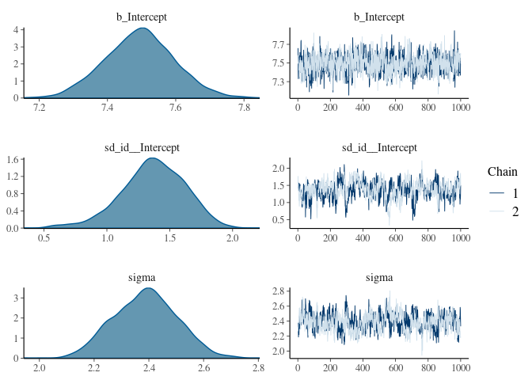

# Example data

We will use the simulated gryphon dataset ( [download zip file](/docs/data/gryphons.zip) ).

We need to load both the phenotypic data `gryphon.csv` and the pedigree `gryphonped.csv`.


```r
phenotypicdata <- read.csv("data/gryphon.csv")
pedigreedata <- read.csv("data/gryphonped.csv")
```

The phenotypic data look like this:


```r
head(phenotypicdata)
```

```
##     id mother cohort sex birth_weight tarsus_length
## 1 1029   1145    968   1        10.77         24.77
## 2 1299    811    968   1         9.30         22.46
## 3  643    642    970   2         3.98         12.89
## 4 1183   1186    970   1         5.39         20.47
## 5 1238   1237    970   2        12.12            NA
## 6  891    895    970   1           NA            NA
```

We will use `birth_weight` as a response variable.

And the pedigree looks like this:


```r
head(pedigreedata)
```

```
##     id mother father
## 1 1306     NA     NA
## 2 1304     NA     NA
## 3 1298     NA     NA
## 4 1293     NA     NA
## 5 1290     NA     NA
## 6 1288     NA     NA
```

```r
tail(pedigreedata)
```

```
##       id mother father
## 1304 127    917     NA
## 1305 117    550     NA
## 1306  95     29     NA
## 1307 158    689     NA
## 1308 131   1223     NA
## 1309 144   1222     NA
```


# Simplest animal model

Here is the simplest implementation of an animal model in brms.

First, we load the package:


```r
library(brms);library(nadiv)
```

To be able to fit an animal model, brms needs the relatedness (relationship) matrix of the pedigree and not its inverse (as in other softwares). This can be estimated using the nadiv package created by Pr. Matthew Wolak (https://cran.r-project.org/web/packages/nadiv/index.html).


```r
Amat <- as.matrix(nadiv::makeA(pedigreedata))
```

Now we can fit the model of `birth_weight` to estimate three parameters:

* an additive genetic variance (corresponding to the `id` column) 
* a residual variance
* an intercept


```r
brms_m1.1 <- brm(
  birth_weight ~ 1 + #Response and Fixed effect formula
    (1 | gr(id, cov = Amat)),# Random effect formula & correlations among random effect levels (here breeding values)
  data = phenotypicdata,# data set
  data2 = list(Amat = Amat), # Amatrix
  family = gaussian(), # family
  chains = 2, cores = 2, iter = 2000 # two mcmc chains run on two cores (in parallel) for 2000 iterations each
)
```


```r
plot(brms_m1.1)
```

<!-- -->


