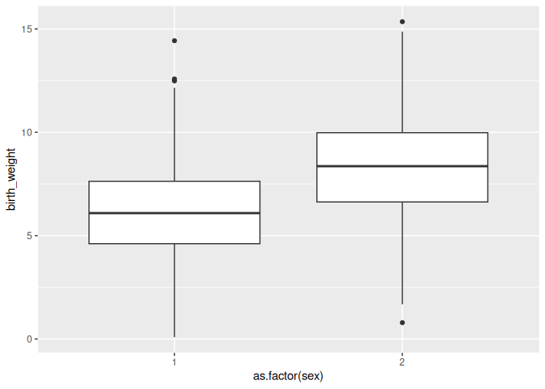
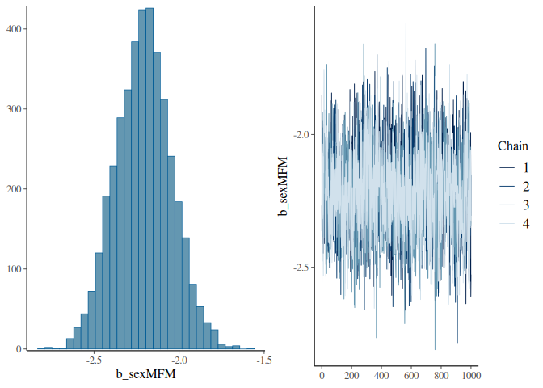
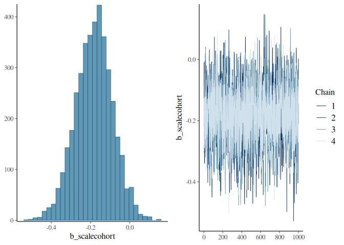
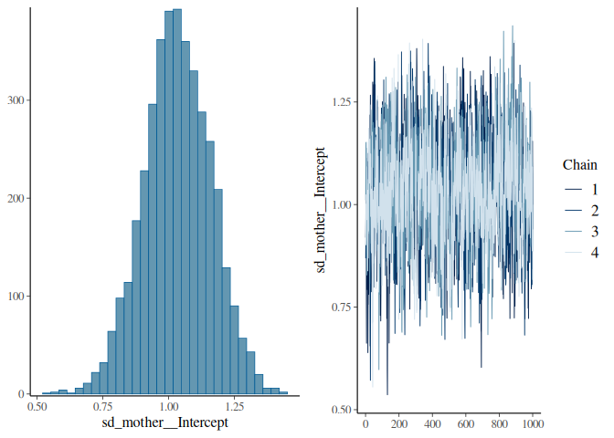
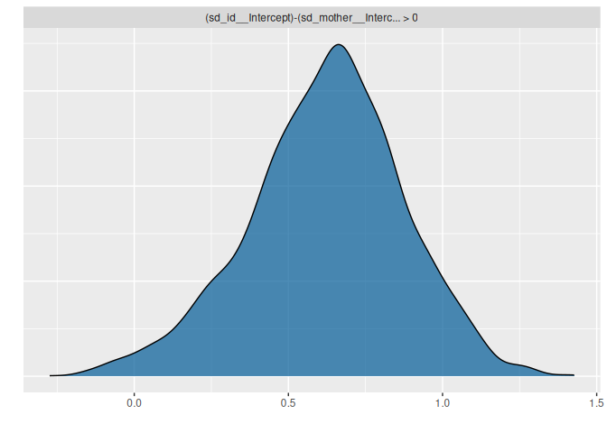
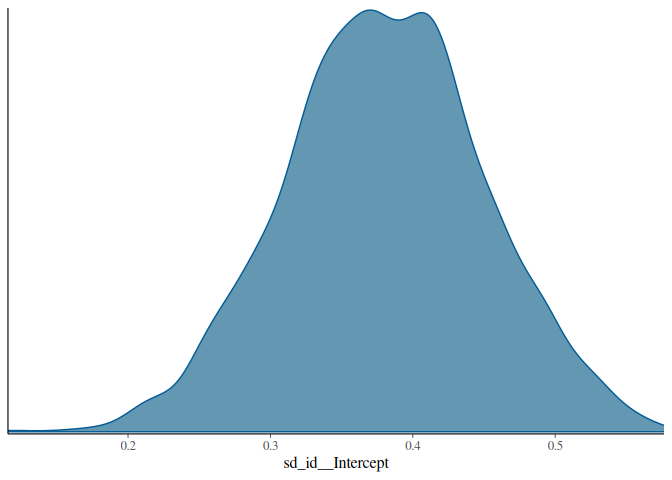

Here we will see how to add fixed effects and random effects to our linear animal model. We will also see how the addition of these effects can impact the calculation of heritability.

We still use the gryphon dataset with `birth_weight` as the response, and brms.


``` r
phenotypicdata <- read.csv("data/gryphon.csv")
pedigreedata <- read.csv("data/gryphonped.csv")
```


``` r
library(brms)
library(nadiv)
```


``` r
Amat <- nadiv::makeA(pedigree = pedigreedata)
```

## Adding fixed effects

We will start by adding sex as a fixed effect. Why? Because sexes appear to be quite different in term of birth weight and our previous model does not capture those differences. A model that accounts for important structures in the response variables will fit the data better and will tend to provide empirical parameter estimates that are more accurate, precise and better correspond to the conceptual parameter of interest. The addition of any fixed effect must be motivated by the scientific question or the need to control structures in the data though, think about it carefully.

We can check that sexes are quite different in birth weight visually:


``` r
library(ggplot2)
ggplot(phenotypicdata, aes(x=as.factor(sex), y=birth_weight)) + geom_boxplot()
```

```
## Warning: Removed 230 rows containing non-finite outside the scale range
## (`stat_boxplot()`).
```

<!-- -->

Sex is coded with values 1 and 2. It can be simpler to read model outputs if sex is coded with values 0 and 1, or with explicit labels. We will use `"M"` and `"F"` and store the new encoding as the column `sexMF`:


``` r
phenotypicdata$sexMF <- ifelse(phenotypicdata$sex==1, "M", "F")
```

To add `sexMF` as a fixed effect to the model we add the column name in the line which contains the response variable, on the right-hand side of the tilde (`~`). Different fixed effects can be added using `+` signs. The `1` that was already there stands for the intercept. 


``` r
brms_m1.3 <- brm(
  birth_weight ~ 1 + sexMF + #Response and Fixed effect formula
    (1 | gr(id, cov = Amat)),# Random effect formula & correlations among random effect levels (here breeding values)
  data = phenotypicdata,# data set
  data2 = list(Amat = Amat), # Amatrix
  family = gaussian(), # family
  chains = 4, cores = 4, iter = 2000 # four mcmc chains run on four cores (in parallel) for 2000 iterations each
)
```


``` r
summary(brms_m1.3)
```

```
##  Family: gaussian 
##   Links: mu = identity 
## Formula: birth_weight ~ 1 + sexMF + (1 | gr(id, cov = Amat)) 
##    Data: phenotypicdata (Number of observations: 854) 
##   Draws: 4 chains, each with iter = 2000; warmup = 1000; thin = 1;
##          total post-warmup draws = 4000
## 
## Multilevel Hyperparameters:
## ~id (Number of levels: 854) 
##               Estimate Est.Error l-95% CI u-95% CI Rhat Bulk_ESS Tail_ESS
## sd(Intercept)     1.74      0.14     1.45     2.00 1.02      230      847
## 
## Regression Coefficients:
##           Estimate Est.Error l-95% CI u-95% CI Rhat Bulk_ESS Tail_ESS
## Intercept     8.27      0.14     8.00     8.53 1.00     2554     2994
## sexMFM       -2.21      0.16    -2.53    -1.88 1.00     3041     2981
## 
## Further Distributional Parameters:
##       Estimate Est.Error l-95% CI u-95% CI Rhat Bulk_ESS Tail_ESS
## sigma     1.73      0.11     1.51     1.95 1.02      240      764
## 
## Draws were sampled using sampling(NUTS). For each parameter, Bulk_ESS
## and Tail_ESS are effective sample size measures, and Rhat is the potential
## scale reduction factor on split chains (at convergence, Rhat = 1).
```

The model summary shows a posterior mean difference of -2.209 of males compared to females. You know the difference is about males because the name of the parameter in the summary ends with "M". Females are therefore the reference in this model.

Fixed effects and their summary of brms can accessed using the `fixef()` function:

``` r
fixef(brms_m1.3)
```

```
##            Estimate Est.Error      Q2.5     Q97.5
## Intercept  8.266104 0.1356811  8.000633  8.534164
## sexMFM    -2.208580 0.1642852 -2.525847 -1.881693
```
(set `summary = TRUE` to obtain their posterior distribution).

We can visualise the trace and posterior distribution of the difference:


``` r
plot(brms_m1.3, variable = "sexMF", regex = TRUE)
```

<!-- -->

### "Testing" fixed effects

We can use the `hypothesis()` function to perform a test on whether the effect is significantly different from 0 or not:

``` r
hypothesis(brms_m1.3, "sexMFM = 0")
```

```
## Hypothesis Tests for class b:
##     Hypothesis Estimate Est.Error CI.Lower CI.Upper Evid.Ratio Post.Prob Star
## 1 (sexMFM) = 0    -2.21      0.16    -2.53    -1.88         NA        NA    *
## ---
## 'CI': 90%-CI for one-sided and 95%-CI for two-sided hypotheses.
## '*': For one-sided hypotheses, the posterior probability exceeds 95%;
## for two-sided hypotheses, the value tested against lies outside the 95%-CI.
## Posterior probabilities of point hypotheses assume equal prior probabilities.
```
A star appears at the end if the CI interval excludes 0.

A tailored test can be performed for a specific value:

``` r
hypothesis(brms_m1.3, "sexMFM < -2")
```

```
## Hypothesis Tests for class b:
##          Hypothesis Estimate Est.Error CI.Lower CI.Upper Evid.Ratio Post.Prob Star
## 1 (sexMFM)-(-2) < 0    -0.21      0.16    -0.48     0.06       8.46      0.89     
## ---
## 'CI': 90%-CI for one-sided and 95%-CI for two-sided hypotheses.
## '*': For one-sided hypotheses, the posterior probability exceeds 95%;
## for two-sided hypotheses, the value tested against lies outside the 95%-CI.
## Posterior probabilities of point hypotheses assume equal prior probabilities.
```


### Adding a continuous fixed effect

There are not many variables to experiment with in this dataset, but let's say we want to include cohort as a fixed effect, for instance because we want to account for a linear change in the response through time.

Let's just re-scale cohort to avoid changing the intercept and perhaps to help a bit the estimation algorithm (it is often easier to have fixed effects on similar scales) and interpretation (it may be easier to see what is a big or small effect when fixed effects are standardized, although it is by no mean necessary).


``` r
brms_m1.4 <- 
  brm(birth_weight ~ 1 + sexMF + scale(cohort) + (1 | gr(id, cov = Amat)),
      data = phenotypicdata,
      data2 = list(Amat = Amat),
      family = gaussian(),
      chains = 4, cores = 4, iter = 2000)
```


``` r
summary(brms_m1.4)
```

```
##  Family: gaussian 
##   Links: mu = identity 
## Formula: birth_weight ~ 1 + sexMF + scale(cohort) + (1 | gr(id, cov = Amat)) 
##    Data: phenotypicdata (Number of observations: 854) 
##   Draws: 4 chains, each with iter = 2000; warmup = 1000; thin = 1;
##          total post-warmup draws = 4000
## 
## Multilevel Hyperparameters:
## ~id (Number of levels: 854) 
##               Estimate Est.Error l-95% CI u-95% CI Rhat Bulk_ESS Tail_ESS
## sd(Intercept)     1.75      0.15     1.46     2.03 1.02      243      535
## 
## Regression Coefficients:
##             Estimate Est.Error l-95% CI u-95% CI Rhat Bulk_ESS Tail_ESS
## Intercept       8.30      0.14     8.03     8.57 1.00     2635     2857
## sexMFM         -2.23      0.16    -2.55    -1.91 1.00     2842     3054
## scalecohort    -0.18      0.09    -0.37     0.00 1.00     2287     2696
## 
## Further Distributional Parameters:
##       Estimate Est.Error l-95% CI u-95% CI Rhat Bulk_ESS Tail_ESS
## sigma     1.71      0.12     1.47     1.94 1.02      238      441
## 
## Draws were sampled using sampling(NUTS). For each parameter, Bulk_ESS
## and Tail_ESS are effective sample size measures, and Rhat is the potential
## scale reduction factor on split chains (at convergence, Rhat = 1).
```

As previously we can look at the fixed effects more precisely:

``` r
fixef(brms_m1.4)
```

```
##               Estimate Est.Error       Q2.5        Q97.5
## Intercept    8.2977887 0.1401074  8.0302213  8.574834127
## sexMFM      -2.2316631 0.1638499 -2.5492072 -1.913676925
## scalecohort -0.1822339 0.0945429 -0.3724501  0.002876029
```

And plot it:

``` r
plot(brms_m1.4, variable = "cohort", regex = TRUE)
```

<!-- -->


## Adding random effects

We will often want to include random effects in addition to the additive genetic variance random effect. In particular it is an important way to control for non-genetic sources of similarity between relatives which may inflate the estimates of additive genetic variance and heritability.

For instance, it is very common to include the mother identity as a random effect, as individuals born from the same mother may share an environment in early life (e.g., nest or food provisioning).

To include mother as a random effect we write the variable name between parentheses like for `id`, but with a more straightforward syntax like `(1|mother)` (same as in the lme4 package).


``` r
brms_m1.5 <- 
  brm(birth_weight ~ 1 + sexMF + scale(cohort) + (1 | gr(id, cov = Amat)) + (1|mother),
      data = phenotypicdata,
      data2 = list(Amat = Amat),
      family = gaussian(),
      chains = 4, cores = 4, iter = 2000)
```


``` r
summary(brms_m1.5)
```

```
## Warning: Parts of the model have not converged (some Rhats are > 1.05). Be careful when analysing the results! We recommend running more
## iterations and/or setting stronger priors.
```

```
##  Family: gaussian 
##   Links: mu = identity 
## Formula: birth_weight ~ 1 + sexMF + scale(cohort) + (1 | gr(id, cov = Amat)) + (1 | mother) 
##    Data: phenotypicdata (Number of observations: 854) 
##   Draws: 4 chains, each with iter = 2000; warmup = 1000; thin = 1;
##          total post-warmup draws = 4000
## 
## Multilevel Hyperparameters:
## ~id (Number of levels: 854) 
##               Estimate Est.Error l-95% CI u-95% CI Rhat Bulk_ESS Tail_ESS
## sd(Intercept)     1.65      0.20     1.25     2.07 1.12       25       34
## 
## ~mother (Number of levels: 394) 
##               Estimate Est.Error l-95% CI u-95% CI Rhat Bulk_ESS Tail_ESS
## sd(Intercept)     1.03      0.13     0.78     1.29 1.00      714     1488
## 
## Regression Coefficients:
##             Estimate Est.Error l-95% CI u-95% CI Rhat Bulk_ESS Tail_ESS
## Intercept       8.32      0.14     8.05     8.59 1.00     3636     2981
## sexMFM         -2.24      0.16    -2.54    -1.94 1.00     4565     3506
## scalecohort    -0.18      0.10    -0.39     0.01 1.00     3762     2935
## 
## Further Distributional Parameters:
##       Estimate Est.Error l-95% CI u-95% CI Rhat Bulk_ESS Tail_ESS
## sigma     1.48      0.18     1.04     1.79 1.12       24       32
## 
## Draws were sampled using sampling(NUTS). For each parameter, Bulk_ESS
## and Tail_ESS are effective sample size measures, and Rhat is the potential
## scale reduction factor on split chains (at convergence, Rhat = 1).
```


We can access specifically the random effects standard deviations using :

``` r
VarCorr(brms_m1.5)
```

```
## $id
## $id$sd
##           Estimate Est.Error     Q2.5    Q97.5
## Intercept 1.654824 0.2022236 1.246394 2.066826
## 
## 
## $mother
## $mother$sd
##           Estimate Est.Error      Q2.5    Q97.5
## Intercept 1.033022 0.1276249 0.7815973 1.285087
## 
## 
## $residual__
## $residual__$sd
##  Estimate Est.Error     Q2.5    Q97.5
##  1.481244 0.1800696 1.037633 1.786172
```
(setting `summary = FALSE` returns the posterior draws.

We can visualise the trace and posterior distribution of the variance associated with mother identity as:

``` r
plot(brms_m1.5, variable = "sd_mother", regex = TRUE)
```

<!-- -->

We can estimate if the variance associated with mother identity is less than the additive genetic variance:


``` r
hyp <- hypothesis(brms_m1.5, "sd_id__Intercept > sd_mother__Intercept", class = NULL)
plot(hyp)
```

<!-- -->

(here the additive genetic variance is very likely greater than the mother variance.)


We can add a third random effect, for instance cohort (yes, we can include cohort both as fixed and random effect):


``` r
brms_m1.6 <- 
  brm(birth_weight ~ 1 + sexMF + scale(cohort) + (1 | gr(id, cov = Amat)) + (1|mother) + (1|cohort),
      data = phenotypicdata,
      data2 = list(Amat = Amat),
      family = gaussian(),
      chains = 4, cores = 4, iter = 2000)
```
(beware, this model is throwing a warning because it was actually not run for a long enough time)


## Computing heritability without accounting for fixed effects

We could compute heritability as the ratio of additive genetic variance over the sum of random effect and residual variance. It becomes a bit difficult to handle that many variables in the `hypothesis()` function, so we can do the computation of heritability "by hand".


``` r
m1.6_vars <- 
  as_draws_matrix(brms_m1.6, variable = "^(sd_|sigma)", regex = TRUE)^2
h2_nofixef <- m1.6_vars[ , "sd_id__Intercept"] / rowSums(m1.6_vars)
```

We can then look at some point estimates for this heritability:

``` r
summary(h2_nofixef)
```

```
## # A tibble: 1 × 10
##   variable          mean median     sd    mad    q5   q95  rhat ess_bulk ess_tail
##   <chr>            <dbl>  <dbl>  <dbl>  <dbl> <dbl> <dbl> <dbl>    <dbl>    <dbl>
## 1 sd_id__Intercept 0.380  0.380 0.0698 0.0695 0.264 0.496  1.02     210.     329.
```

We can also use the `bayesplot` package to look at the distribution of the heritability:

``` r
bayesplot::mcmc_dens(h2_nofixef)
```

<!-- -->

Note that the estimate of heritability is a bit less than what we estimated from model1.2. This is likely because the random effect `mother` corrects for some similarity between siblings that was conflated with additive genetic variance in the that did not account for mother identity.

However, this calculation of heritability may not be satisfactory as it leaves out some variance that is accounted in the fixed effects.

## Computing heritability while accounting for fixed effects

Often we will want to include the variance accounted in the fixed effect back into the computation of heritability. But this is a complex issue and depending on data and scientific questions it may be best to either exclude fixed effects, include all fixed effects, or include some fixed effects but not others. It may even be useful to exclude some random effects (for instance if a random effect structurally captures measurement error.)

The variance due to fixed effect can be computed as the variance in model predictions (without accounting for random effects). 
Those predictions can be computed as the matrix product of predictors by parameter estimates.
In brms it can be done like this:


``` r
predictions1.6 <-  standata(brms_m1.6)$X %*% t(fixef(brms_m1.6, summary = FALSE))
```

This object contains one row for each data point and one column for each posterior sample.


``` r
dim(predictions1.6)
```

```
## [1]  854 4000
```

For each posterior sample we can compute the variance:


``` r
fixef_variance <- apply(predictions1.6, MARGIN = 2, var)
```

We can then plug it in the calculation of heritability:


``` r
h2_fixef <- m1.6_vars[ , "sd_id__Intercept"] / (fixef_variance + rowSums(m1.6_vars))
```


``` r
summary(h2_fixef)
```

```
## # A tibble: 1 × 10
##   variable          mean median     sd    mad    q5   q95  rhat ess_bulk ess_tail
##   <chr>            <dbl>  <dbl>  <dbl>  <dbl> <dbl> <dbl> <dbl>    <dbl>    <dbl>
## 1 sd_id__Intercept 0.326  0.325 0.0602 0.0589 0.226 0.426  1.02     204.     318.
```


