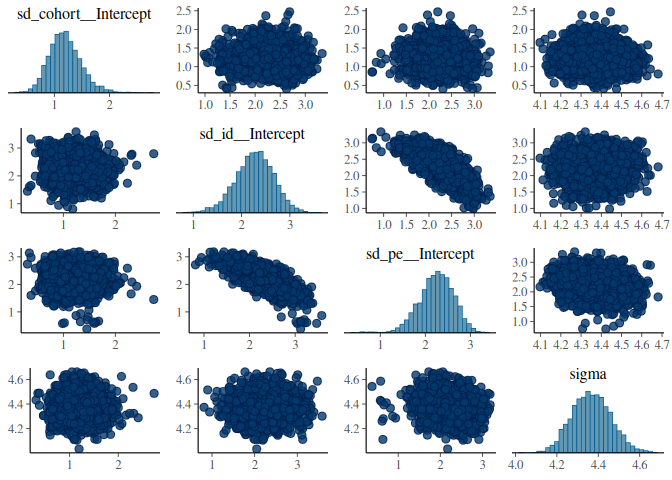

{}
Whenever a dataset contains repeated measurements of a trait for a same individual it is possible to model variance attributed to **"permanent environmental effects"**. Permanent environmental effects are persistant non-genetic effects that influence variation among individuals and therefore impact phenotypic variation. If not accounted for, permanent environmental effects can inflate estimates of additive genetic variance and heritability. As a reward of modelling permanent environments you get to estimate **repeatability**.
{}

{}
To model repeated measurements we switch to a new dataset, `gryphonRepeatedMeas.csv`. We will model `laydate`, which is observed once a year in females when they breed. We want to estimate the heritability and, this time, the **repeatability** of `laydate`. The pedigree is the same we have used before. 
{}


``` r
library(brms)
library(nadiv)
```


``` r
repeatedphenotypicdata <- read.csv("data/gryphonRepeatedMeas.csv")
pedigreedata <- read.csv("data/gryphonped.csv")
```


``` r
Amat <- nadiv::makeA(pedigree = pedigreedata)
```


The key to repeated measurement animal models is having a duplicate of the individual identity in the dataset. This allows to estimate a breeding value for each individual, that is connected to the relatedness matrix, and a permanent environment value that is not. 
Let's keep `id` as the additive genetic random effect and call the duplicate `pe` (for permanent environment).


``` r
repeatedphenotypicdata$pe <- repeatedphenotypicdata$id
```

We will fit a random effect for `id`, one for `pe` and one for `cohort`:


``` r
brms_r1 <- 
  brm(lay_date ~ 1 + age +  (1 | gr(id, cov = Amat)) + (1|pe) + (1|cohort), 
      data = repeatedphenotypicdata,
      data2 = list(Amat = Amat), 
      family = gaussian(),
      chains = 4, cores = 4, iter = 2000)
```

```
## Warning: Bulk Effective Samples Size (ESS) is too low, indicating posterior means and medians may be unreliable.
## Running the chains for more iterations may help. See
## https://mc-stan.org/misc/warnings.html#bulk-ess
```

There is a bit of negative correlation between `id` and `pe` in the MCMC sampling, which is usual with that kind of models, because it is difficult to disentangle both of the individual effects:

``` r
pairs(brms_r1, variable = "^(sd|sigma)", regex = TRUE)
```

<!-- -->

Assuming we are happy with the model fit, we can compute heritability as:

``` r
heritability1 <- 
  hypothesis(brms_r1, "sd_id__Intercept^2 / (sd_id__Intercept^2 + sd_pe__Intercept^2 + sd_cohort__Intercept^2 + sigma^2) = 0", class = NULL)
heritability1
```

```
## Hypothesis Tests for class :
##                 Hypothesis Estimate Est.Error CI.Lower CI.Upper Evid.Ratio Post.Prob Star
## 1 (sd_id__Intercept... = 0     0.17      0.05     0.07     0.28         NA        NA    *
## ---
## 'CI': 90%-CI for one-sided and 95%-CI for two-sided hypotheses.
## '*': For one-sided hypotheses, the posterior probability exceeds 95%;
## for two-sided hypotheses, the value tested against lies outside the 95%-CI.
## Posterior probabilities of point hypotheses assume equal prior probabilities.
```

and repeatability as:


``` r
repeatability1 <- 
  hypothesis(brms_r1, "(sd_id__Intercept^2 +  sd_pe__Intercept^2) / (sd_id__Intercept^2 + sd_pe__Intercept^2 + sd_cohort__Intercept^2 + sigma^2) = 0", class = NULL)
repeatability1
```

```
## Hypothesis Tests for class :
##                 Hypothesis Estimate Est.Error CI.Lower CI.Upper Evid.Ratio Post.Prob Star
## 1 ((sd_id__Intercep... = 0     0.34      0.03     0.28      0.4         NA        NA    *
## ---
## 'CI': 90%-CI for one-sided and 95%-CI for two-sided hypotheses.
## '*': For one-sided hypotheses, the posterior probability exceeds 95%;
## for two-sided hypotheses, the value tested against lies outside the 95%-CI.
## Posterior probabilities of point hypotheses assume equal prior probabilities.
```

If we want to take into account the variation due to age, the calculations become:


``` r
vars <- as_draws_matrix(brms_r1, variable = "^(sd_|sigma)", regex = TRUE)^2
predictions <- standata(brms_r1)$X %*% t(fixef(brms_r1, summary = FALSE))
fixef_variance <- apply(predictions, MARGIN = 2, var)

heritability2 <- vars[ , "sd_id__Intercept"] / (fixef_variance + rowSums(vars))
summary(heritability2)
```

```
## # A tibble: 1 × 10
##   variable          mean median     sd    mad     q5   q95  rhat ess_bulk ess_tail
##   <chr>            <dbl>  <dbl>  <dbl>  <dbl>  <dbl> <dbl> <dbl>    <dbl>    <dbl>
## 1 sd_id__Intercept 0.161  0.159 0.0509 0.0521 0.0803 0.248  1.02     334.     730.
```

and


``` r
repeatability2 <- (vars[ , "sd_id__Intercept"] + vars[ , "sd_pe__Intercept"] ) / (fixef_variance + rowSums(vars))
summary(repeatability2)
```

```
## # A tibble: 1 × 10
##   variable          mean median     sd    mad    q5   q95  rhat ess_bulk ess_tail
##   <chr>            <dbl>  <dbl>  <dbl>  <dbl> <dbl> <dbl> <dbl>    <dbl>    <dbl>
## 1 sd_id__Intercept 0.319  0.319 0.0289 0.0288 0.271 0.367  1.00    1146.    2061.
```


{}

The model we fitted can be written as
$$
y_{i,t} = \mu + \boldsymbol{X\beta} + a_i + r_i + \epsilon_{i,t}
$$
with $y_{i,t}$ the `laydate` of individual $i$ on year $t$, $\mu$ the intercept, $\boldsymbol{X\beta}$ fixed effects, $a_i$ individual $i$ breeding value, $r_i$ individual $i$ permanent environment or non-additive-genetic repeatable value and $\epsilon_{i,t}$ the residual. 
The model assumes $a_i$, $r_i$, and $\epsilon_{i,t}$ are drawn from Gaussian distribution of variance $V_A$, $V_R$ and $V_E$, respectively. 

Narrow-sense heritability and repeatability are ratios of phenotypic variance explained by additive genetic variance, or repeatable variance (which includes additive genetic and other sources of variance). Depending on the context and research question, the phenotypic variance ($V_P$) will be the sum of $V_A$, $V_R$, $V_E$, and optionally the variance explained by all or part of the fixed effects ($V_F$).

Narrow-sense heritability is defined as:
$$ h^2 = \frac{V_A}{V_P} = \frac{V_A}{V_A + V_R + V_E + V_F} $$ 
and repeatability as:
$$ R^2=\frac{V_A + V_R}{V_P} =  \frac{V_A + V_R}{V_A + V_R + V_E + V_F} $$. 

Defined this way, repeatability is always greater (or equal) than heritability.

{}


{}
Be aware that repeatability is not uniquely defined for a trait and population, but depends a lot on data selection and model choice. The time frame considered is particularly important. For instance, repeatability could be high when estimated within a year, but much lower across different years. It is possible to estimate several types of repeatabilities with a single model (see Ponzi et al. below).
{}

## Reading to go further

- Kruuk & Hadfield, 2007. How to separate genetic and environmental causes of similarity between relatives. Journal of Evolutionary Biology https://doi.org/10.1111/j.1420-9101.2007.01377.x
- Ponzi & al, 2018. Heritability, selection, and the response to selection in the presence of phenotypic measurement error: Effects, cures, and the role of repeated measurements. Evolution https://doi.org/10.1111/evo.13573

