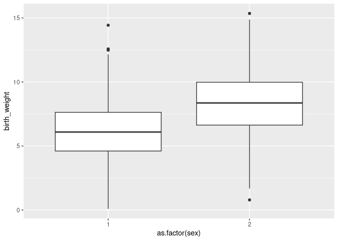

Here we will see how to add fixed effects and random effects to our linear animal model. We will also see how the addition of these effects can impact the calculation of heritability.

We still use the gryphon dataset with `birth_weight` as the response, and gremlin.


``` r
phenotypicdata <- read.csv("../data/gryphon.csv")
pedigreedata <- read.csv("../data/gryphonped.csv")
```


``` r
library(gremlin)
library(nadiv)
```


``` r
inverseAmatrix <- makeAinv(pedigree = pedigreedata)$Ainv
```


Previously we run the simple model `grMod1.2` (not run again here):


``` r
phenotypicdata$id <- as.factor(phenotypicdata$id)
grMod1.2 <- gremlin(birth_weight ~ 1, #Response and Fixed effect formula
                   random = ~id, # Random effect formula
          ginverse = list(id = inverseAmatrix), # correlations among random effect levels
          data = phenotypicdata, # data set
          maxit = 10) # run the model for shorter compared to the default
```

## Adding fixed effects

We will start by adding sex as a fixed effect. Why? Because sexes appear to be quite different in term of birth weight and our `grMod1.2` does not capture those differences. A model that accounts for important structures in the response variables will fit the data better and will tend to provide empirical parameter estimates that are more accurate, precise and better correspond to the conceptual parameter of interest. The addition of any fixed effect must be motivated by the scientific question or the need to control structures in the data though, think about it carefully.

We can check that sexes are quite different in birth weight visually:


``` r
library(ggplot2)
ggplot(phenotypicdata, aes(x=as.factor(sex), y=birth_weight)) + geom_boxplot()
```

```
## Warning: Removed 230 rows containing non-finite outside the scale range (`stat_boxplot()`).
```

<!-- -->

Sex is coded with values 1 and 2. It can be simpler to read model outputs if sex is coded with values 0 and 1, or with explicit labels. We will use `"M"` and `"F"` and store the new encoding as the column `sexMF`:


``` r
phenotypicdata$sexMF <- ifelse(phenotypicdata$sex==1, "M", "F")
```

To add `sexMF` as a fixed effect to the model we add the column name in the line which contains the response variable, on the right-hand side of the tilde (`~`). Different fixed effects can be added using `+` signs. The `1` that was already there stands for the intercept. 


``` r
grMod1.3 <- gremlin(birth_weight ~ 1 + sexMF, #Response and Fixed effect formula
                   random = ~ id,
          ginverse = list(id = inverseAmatrix), 
          data = phenotypicdata,
          maxit = 10) 
```


``` r
summary(grMod1.3)
```

```
## 
##  Linear mixed model fit by REML [' gremlin ']
##  REML log-likelihood: -1165.093 
## 	 lambda: FALSE 
## 
##  elapsed time for model: 0.1141 
## 
##  Scaled residuals:
##      Min       1Q   Median       3Q      Max 
## -2.25337 -0.49418 -0.02509  0.52690  2.18919 
## 
##  (co)variance parameters: ~id 
## 		    rcov: ~units 
##         Estimate Std. Error
## G.id       3.060     0.5244
## ResVar1    2.938     0.4161
## 
##  (co)variance parameter sampling correlations:
##            G.id ResVar1
## G.id     1.0000 -0.8046
## ResVar1 -0.8046  1.0000
## 
##  Fixed effects: birth_weight ~ 1 + sexMF 
##             Estimate Std. Error z value
## (Intercept)    8.266     0.1375   60.11
## sexMFM        -2.207     0.1620  -13.62
```

The model summary shows a mean difference of -2.207 of males compared to females. You know the difference is about males because the name of the parameter in the summary ends with "M". Females are therefore the reference in this model.


### Adding a continuous fixed effect

There are not many variables to experiment with in this dataset, but let's say we want to include cohort as a fixed effect, for instance because we want to account for a linear change in the response through time.

Let's just re-scale cohort to avoid changing the intercept and perhaps to help a bit the estimation algorithm (it is often easier to have fixed effects on similar scales) and interpretation (it may be easier to see what is a big or small effect when fixed effects are standardized, although it is by no means necessary).


``` r
grMod1.4 <- gremlin(birth_weight ~ 1 + sexMF + scale(cohort), #Response and Fixed effect formula
                   random = ~ id, 
          ginverse = list(id = inverseAmatrix),
          data = phenotypicdata) 
```


``` r
summary(grMod1.4)
```

```
## 
##  Linear mixed model fit by REML [' gremlin ']
##  REML log-likelihood: -1165.68 
## 	 lambda: FALSE 
## 
##  elapsed time for model: 0.0702 
## 
##  Scaled residuals:
##     Min      1Q  Median      3Q     Max 
## -2.2376 -0.4755 -0.0224  0.5292  2.1914 
## 
##  (co)variance parameters: ~id 
## 		    rcov: ~units 
##         Estimate Std. Error
## G.id       3.065     0.5246
## ResVar1    2.919     0.4155
## 
##  (co)variance parameter sampling correlations:
##            G.id ResVar1
## G.id     1.0000 -0.8052
## ResVar1 -0.8052  1.0000
## 
##  Fixed effects: birth_weight ~ 1 + sexMF + scale(cohort) 
##               Estimate Std. Error z value
## (Intercept)     8.2944    0.13825  59.997
## sexMFM         -2.2327    0.16232 -13.755
## scale(cohort)  -0.1788    0.09504  -1.881
```


## Adding random effects

We will often want to include random effects in addition to the additive genetic variance random effect. In particular it is an important way to control for non-genetic sources of similarity between relatives which may inflate the estimates of additive genetic variance and heritability.

For instance, it is very common to include the mother identity as a random effect, as individuals born from the same mother may share an environment in early life (e.g., nest or food provisioning).

To include mother as a random effect we first need to ensure we convert the integer codes to a factor, then write the variable name in the argument `random`, after `ìd +`. We do not need to change the argument `ginverse` if we assume that the levels of the additional random effect are uncorrelated (this is often not strictly true, and it can be interesting to model the genetic correlations between maternal levels, but this is a more advanced topic.)


``` r
phenotypicdata$motherFac <- as.factor(phenotypicdata$mother) 
grMod1.5 <- gremlin(birth_weight ~ 1 + sexMF + scale(cohort), 
                   random = ~ id + motherFac, # Random effect formula
          ginverse = list(id = inverseAmatrix),
          data = phenotypicdata) 
```


``` r
summary(grMod1.5)
```

```
## 
##  Linear mixed model fit by REML [' gremlin ']
##  REML log-likelihood: -1152.507 
## 	 lambda: FALSE 
## 
##  elapsed time for model: 0.1022 
## 
##  Scaled residuals:
##      Min       1Q   Median       3Q      Max 
## -1.92627 -0.43668  0.00985  0.48263  1.99117 
## 
##  (co)variance parameters: ~id + motherFac 
## 		    rcov: ~units 
##             Estimate Std. Error
## G.id           2.718     0.5836
## G.motherFac    1.061     0.2645
## ResVar1        2.243     0.4474
## 
##  (co)variance parameter sampling correlations:
##                G.id G.motherFac ResVar1
## G.id         1.0000     -0.1573 -0.8236
## G.motherFac -0.1573      1.0000 -0.1092
## ResVar1     -0.8236     -0.1092  1.0000
## 
##  Fixed effects: birth_weight ~ 1 + sexMF + scale(cohort) 
##               Estimate Std. Error z value
## (Intercept)     8.3192     0.1415  58.773
## sexMFM         -2.2370     0.1581 -14.150
## scale(cohort)  -0.1803     0.1004  -1.796
```

### Testing variance components

We can evaluate whether the maternal environmental effect variance (`motherFac`) is significantly different from zero. The standard errors of the variance components are only approximations under an assumption of large sample theory so we should investigate the change in log-likelihood from including maternal effects. In other words, does a model with maternal effects (`logLik(grMod1.5)`=-1152.5065014) significantly improve the log-likelihood of a model without these effects (`logLik(grMod1.4)`=-1165.6803138)? 

When the data and fixed effects are the same between two models, we can compare the REML log-likelihoods with a likelihood ratio test (LRT), which is performed by the `anova` function:


``` r
anova(grMod1.4, grMod1.5)
```

```
## Data: phenotypicdata
## Fixed formula: birth_weight ~ 1 + sexMF + scale(cohort)
## Models:
## grMod1.4: ~id + [ rcov ] ~units
## grMod1.5: ~id + motherFac + [ rcov ] ~units
##          Df    AIC  logLik deviance  Chisq Chi Df Pr(>Chisq)    
## grMod1.4  5 2341.4 -1165.7   2331.4                             
## grMod1.5  6 2317.0 -1152.5   2305.0 26.348      1  2.852e-07 ***
## ---
## Signif. codes:  0 '***' 0.001 '**' 0.01 '*' 0.05 '.' 0.1 ' ' 1
```

Note that because we are testing a variance against a value at the boundary of the allowable values (parameter space, i.e., zero and REML variances are constrained from being less than or equal 0.0), we need to halve the p-value reported above to get the correct value (see Wilson et al. 2010 An ecologist's guide to the animal model. J. Anim. Ecol. [doi: 10.1111/j.1365-2656.2009.01639.x](https://besjournals.onlinelibrary.wiley.com/doi/full/10.1111/j.1365-2656.2009.01639.x))  


``` r
0.5 * anova(grMod1.4, grMod1.5)[2, "Pr(>Chisq)"]
```

```
## [1] 1.425847e-07
```

Alternatively, it is possible to test the significance of whether variance components are different from other values than just zero. For instance, we can estimate the p-value for the change in log-likelihoods associated with the estimated variance in mother identity being different than 1.5.

Whereas in the last LRT we made an implicit assumption that the reduced model (`grMod1.4`) was analagous to a model where the maternal variance equals zero (because the term was not included in the model), next we have to specify a model where we calculate the likelihood for when maternal variance=1.5. We do this by setting a fixed constraint on that term in the model. We will use the `Gstart` and `Gcon` arguments to `gremlin` to accomplish this.

We code this by first creating a list of constraints on the G-structure (the non-residual variances or covariances) of the current model. Then, we can specify the G element we want fix using the "F" code.


``` r
Gcon_in <- lapply(grMod1.5$grMod$conv, FUN = as.matrix)
Gcon_in
```

```
## $G.id
##      [,1]
## [1,] "P" 
## 
## $G.motherFac
##      [,1]
## [1,] "P" 
## 
## $ResVar1
##      [,1]
## [1,] "P"
```

``` r
# drop the residual and change G.motherFac to "F"
Gcon_in <- Gcon_in[1:2]
Gcon_in[2] <- "F"
Gcon_in
```

```
## $G.id
##      [,1]
## [1,] "P" 
## 
## $G.motherFac
## [1] "F"
```

To specify the numeric value to which we want to constrain maternal variance, we create a list of matrices for the starting parameter values of the G-structure. We will use values for the additive genetic and residual variances close to their estimates from `grMod1.5`.


``` r
Gst_in <- list(matrix(2.5), matrix(1.5))
Gst_in
```

```
## [[1]]
##      [,1]
## [1,]  2.5
## 
## [[2]]
##      [,1]
## [1,]  1.5
```

Now, we provide these to the model call


``` r
grMod1.5fxd <- gremlin(birth_weight ~ 1 + sexMF + scale(cohort), 
                   random = ~ id + motherFac, # Random effect formula
          ginverse = list(id = inverseAmatrix),
          data = phenotypicdata,
          Gstart = Gst_in,
          Gcon = Gcon_in) 

summary(grMod1.5fxd)          
```

From the model summary, we can see a new column in the `(co)variance parameters` section that indicates a fixed constraint on maternal effect variance and the parameter value represents the value at which we fixed this variance. Further, there is an NA for the standard error. Since this variance component was fixed and not part of the optimization procedure to maximize the log-likelihood there is no sampling variance from which to estimate a standard error.

To test for a significant difference between our original estimate of maternal variance (`grMod1.5`=1.0605) and 1.5 we can again use the `anova` function.


``` r
anova(grMod1.5, grMod1.5fxd)
```

```
## Data: phenotypicdata
## Fixed formula: birth_weight ~ 1 + sexMF + scale(cohort)
## Models:
## grMod1.5fxd: ~id + motherFac + [ rcov ] ~units
## grMod1.5: ~id + motherFac + [ rcov ] ~units
##             Df    AIC  logLik deviance Chisq Chi Df Pr(>Chisq)
## grMod1.5fxd  5 2319.5 -1153.7   2307.5                        
## grMod1.5     6 2317.0 -1152.5   2305.0 2.463      1     0.1166
```

So we have strong evidence for the maternal effect variance being greater than zero, but very little evidence this variance is different from 1.5.

We can add a third random effect, for instance cohort (yes, we can include cohort both as fixed and random effect):


``` r
phenotypicdata$cohortFac <- as.factor(phenotypicdata$cohort)

grMod1.6 <- gremlin(birth_weight ~ 1 + sexMF + scale(cohort), 
                   random = ~ id + motherFac + cohortFac, # Random effect formula
          ginverse = list(id = inverseAmatrix),
          data = phenotypicdata) 

summary(grMod1.6)          
```


## Computing heritability without accounting for fixed effects

We could compute heritability as the ratio of additive genetic variance over the sum of random effect and residual variance. In the case of grMod1.6 that would be $h^2 = V_A / (V_A + V_M + V_C + V_R) $

However, when calculating the heritability as a function of these variance components we want to incorporate the uncertainty in each variance component estimate into the final heritability standard error. This is not as straightforward as a simple addition or multiplication of individual standard errors but requires the _delta method_ which is way to approximate the standard error of a function of estimated parameters. 

The `gremlin` function `deltaSE()` implements this method for us. The function has a few different ways to imput your function of variance components (see the help documentation for more information) and the format below uses the gremlin names for variance components in a formula


``` r
(h2_nofixef <- deltaSE(h2 ~ G.id / (G.id + G.motherFac + G.cohortFac + ResVar1),
  grMod1.6))
```

```
##     Estimate Std. Error
## h2 0.3877175  0.0778444
```


Note that the estimate of heritability is a bit less than what we estimated from grMod1.2. This is likely because the random effect `motherFac` corrects for some similarity between siblings that was conflated with additive genetic variance in the trait that did not account for mother identity.

However, this calculation of heritability may not be satisfactory as it leaves out some variance that is accounted in the fixed effects.


## Computing heritability while accounting for fixed effects

Often we will want to include the variance accounted in the fixed effect back into the computation of heritability. But this is a complex issue and depending on data and scientific questions it may be best to either exclude fixed effects, include all fixed effects, or include some fixed effects but not others. It may even be useful to exclude some random effects (for instance if a random effect structurally captures measurement error.)

The variance due to fixed effect can be computed as the variance in model predictions (without accounting for random effects). 
Those predictions can be computed as the matrix product of predictors by parameter estimates.

In `gremlin` it can be done like this:


``` r
X <- grMod1.6$grMod$modMats$X
fxdVec <- summary(grMod1.6)$coefficients[, "Estimate", drop = FALSE]
predictions1.6 <- X %*% fxdVec
```

This object contains one row for each data point and one column for each posterior sample.


``` r
dim(predictions1.6)
```

```
## [1] 854   1
```

The variance explained by fixed effects is the variance of the predictions:


``` r
fixef_variance <- var(as.vector(predictions1.6))
```

We can then plug it in the calculation of heritability:


``` r
(h2_fixef <- deltaSE(h2 ~ G.id /
                 (G.id + G.motherFac + G.cohortFac + ResVar1 + fixef_variance),
  grMod1.6))
```

```
##     Estimate Std. Error
## h2 0.3325475 0.06707782
```


