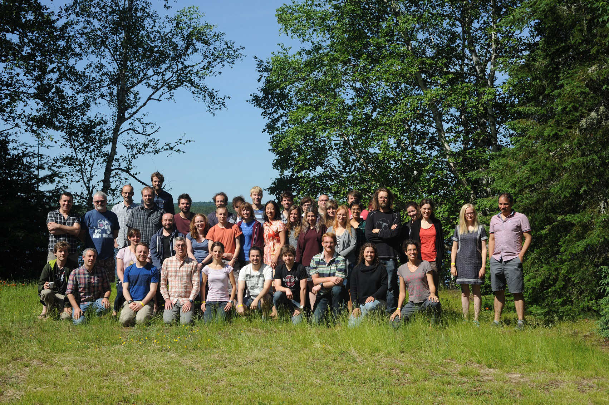



 Wild Animal Model Bi-Annual Meeting



{}
WAMBAM is a small international workshop that happens (roughly) every two years and provides a forum for discussion and collaboration for researchers interested in applying quantitative genetic techniques to natural populations.
{}

## Next meeting

The next meeting was scheduled to happen in Cornwall in June 2020 but was postponed due to the COVID-19 pandemic. 

## Past meetings
### WAMBAM 6 - La Huardière, Québec
July 2017
The meeting was organized by Emmanuel Milot (UQTR) and Denis Réale (UQAM), and featured work on quantitative genetics and genomics, both conspicuously and increasingly facilitated by single nucleotide polymorphism (SNP) genotyping technologies, and discussions of the increasing potential for this work to influence other fields such as demography and conservation.  The scientific contributions were summarized in ([this Molecular Ecology article](https://onlinelibrary.wiley.com/doi/full/10.1111/mec.14510) by the loosing team in the canoe race.

Day trip: Canoe trip up the lake to a beaver dam.

Birders highlight: The strange owl calling that turns out to be a snipe after a night crossing of the lake.

Non-birder wildlife highlight: Beaver dam.

{}
<figure>
	
	<figcaption> Participants of WAMBAM 2017. Left to right are Timothée Bonnet, Denis Réale, Tom Houslay, Dave Coltman, Henrik Jensen, Paula Marjamäki, Drew Sauve, Martin Leclerc, Gabriel Pigeon, Stephen White, Andrew McAdam, Vincent Careau, Charlotte Regan, Gabrielle Dubuc‐Messier, Erwan Quéméré, Darren Hunter, Pascal Marrot, Alexandra Sparks, Walid Mawass, Pirmin Nietlisbach, Nancy Chen, Boris Delahaie, Antoine Favier, Erica Ponzi, Ian Dewan, Dylan Saatoglu, Ryan Earley, David Fisher, Suzanne Bonamour, Alina Niskanen, Alastair Wilson, Maria João Janeiro, Isabel Winney, Laura Gervais, Michael Morrissey, Anne Charmantier, Eryn McFarlane, Céline Teplitsky, Caroline Thomson and Emmanuel Milot. Not in photograph: Jacob Moorad and Yannick Noël. Photograph: Anne Charmantier </figcaption>
</figure>
{}

### WAMBAM 5 - Scotland
2014

Day trip: 

Birders highlight: Common crossbill? (**No** Scottish crossbill though)

Non-birder highlight: Sunny Scotland almost midge-free. 

### WAMBAM 4 - Galeria, Corsica
19th - 23rd September 2011
Organised by Anne Charmantier and held at the Casa Marina in Galeria. Another beautiful location, great science, good food and, as usual, a few too many glasses of wine.

Day trip: Hike over the mountains to the remote village of Girolata, and amazing return trip by boat. Glorious day enjoyed by all!

Birders highlight: no idea but I expect the twitchers saw something to excite them

Non-birders wildlife highlight: Turtles in the pond, lizards everywhere and loads of fish while snorkeling in the bay

### WAMBAM 3 - Degioz, Parco Nazionale Gran Paradiso, Italy
21st - 26th June 2009
Organised by Denis Réale and Achaz von Hardenberg and held in the municipal hall in the stunning Alpine village of Degioz. The location was astonishingly beautiful, the food and drink plentiful, and the science started off a bit scary... but then it was all OK in the end. We all learnt to drink from the 'cup of friendship' and what will happen to us if we ever do that with BLUPs again.

Day trip: Chose your own adventure - either the ibex or the marmot study sites

Birders highlight: Wallcreeper (what do you mean, you didn't see it? It was on the wall outside the hotel for hours...)

Non-birders wildlife highlight: MarmotsIbex! (someone's going to change this to ibexmarmots, aren't they...)

### WAMBAM 2 - Gotland, Sweden
August 2007
Organised by Jon Brommer and Lars Gustafsson on the beautiful Swedish island of Gotland. Plenty of good science, with discussions marked by increaing rumblings of disquiet over BLUP. Plenty of good beer too and a final banquet at which Lars sang Swedish drinking songs while the WAMBAM Queen (LK) table-danced.

Day trip: To the collared flycatcher study site - sadly the bird were on their holidays though.

### WAMBAM 1 - Isle of Rum, Scotland
14th - 19th March 2004
The first WAMBAM was organised by Loeske Kruuk (University of Edinburgh) in Kinloch Castle on the Isle of Rum. There were around 20 attendants from across Europe and North America. The location was stunning - albeit a bit wet and windy. And it was a superb catalyst for many collaborations which are still going on today.

Day trip: To see the red deer study site at Kilmory

Birders highlight: Sea eagle

Non-birders wildlife highlight: red deer and goats

